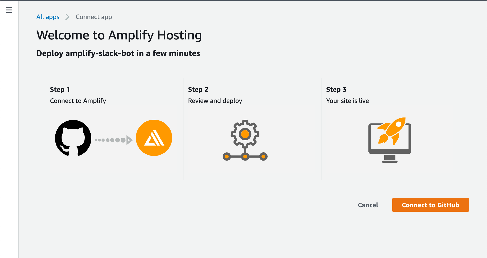
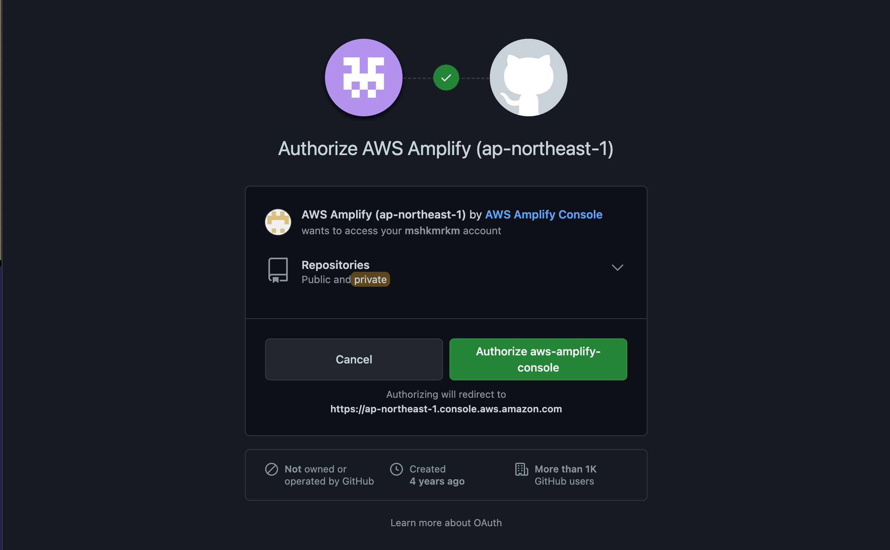
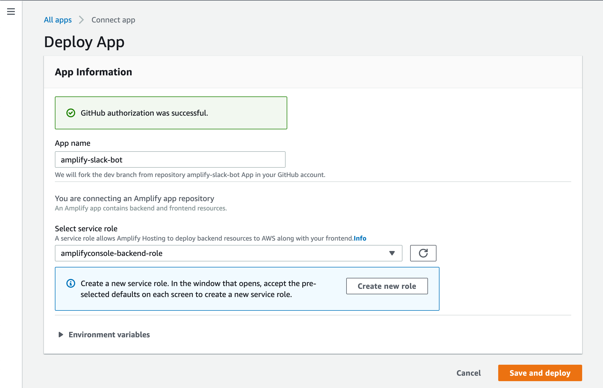
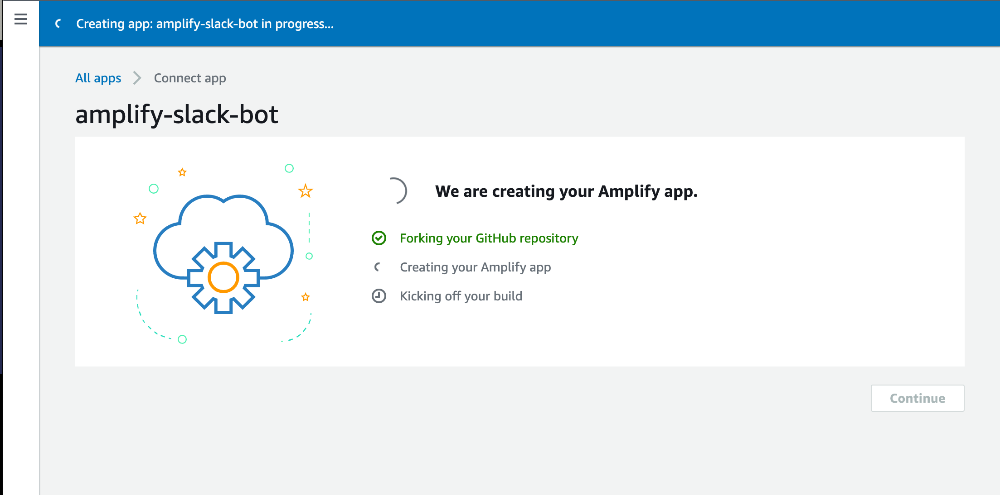
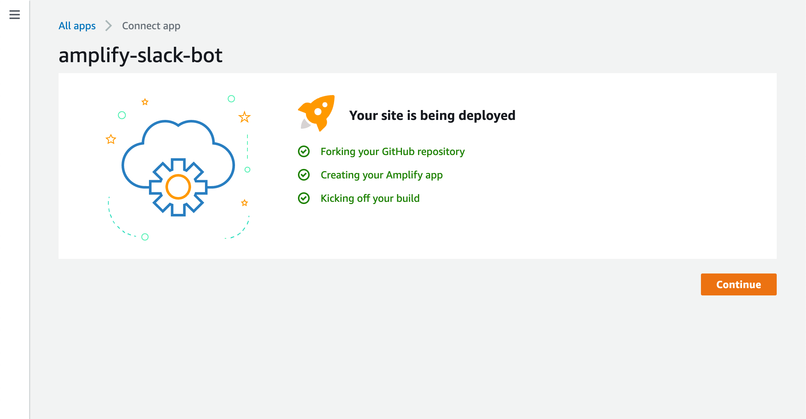
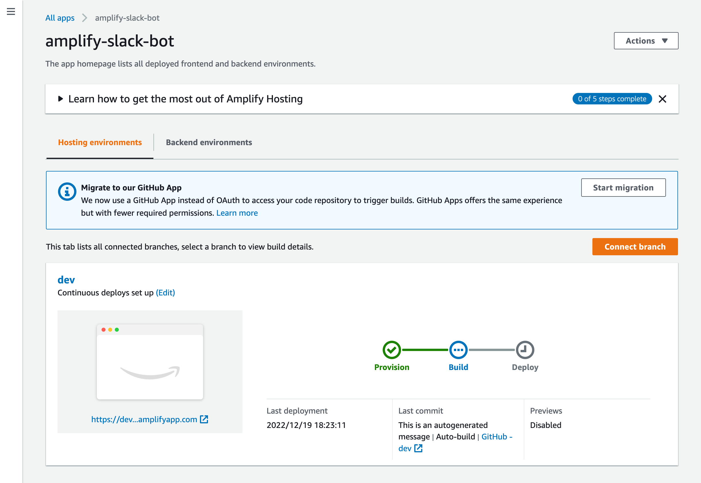
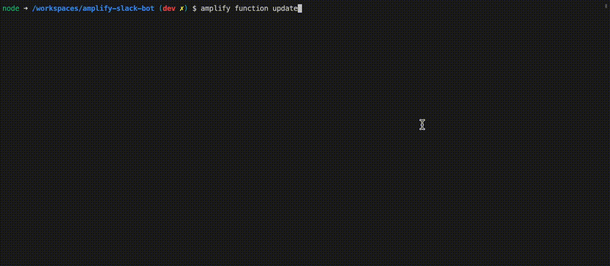

この記事は [AWS AmplifyとAWS×フロントエンド Advent Calendar 2022](https://qiita.com/advent-calendar/2022/amplify)、[AWS Community Builders Advent Calendar 2022](https://adventar.org/calendars/7633) と [ESM Advent Calendar 2022](https://adventar.org/calendars/8218) の 20 日目の記事です。
欲張って3つもクロスポストしてしまいました。

## `Deploy to Amplify Console`ボタン

[公式のAmplifyユーザーガイド](https://docs.aws.amazon.com/amplify/latest/userguide/one-click.html)にも書かれている以下のボタンのことです。


このボタンをブログやGitHubリポジトリのREADME.mdなどに設置すると、そのGitHubリポジトリのAmplifyアプリをワンクリックでデプロイできるというものです。

ただ、私はこのボタンを見たことがなく、ユーザーガイドの説明もシンプルなので具体的にどういう使い勝手なのかが想像できませんでした。また紹介した記事も見たことがなかったので実際にどんな風に使えるのか試してみました。

## 実際にボタンを設置してみた

https://github.com/fossamagna/amplify-slack-bot のリポジトリのREADME.mdに設置しました。ボタン自体は単なるリンクなのでMarkdownなら以下のように書くことで簡単に設置できます。

```md
[](https://console.aws.amazon.com/amplify/home#/deploy?repo=https://github.com/fossamagna/amplify-slack-bot)
```

[](https://console.aws.amazon.com/amplify/home#/deploy?repo=https://github.com/fossamagna/amplify-slack-bot) そして、これが実際に設置したボタンです（クリックすると操作します）。

ちなみに、今回このボタンでデプロイできるのは、Amplify Consoleのビルド結果をSlackに通知するアプリです。
以前から、amplify cliのプラグインとして公開していた https://github.com/fossamagna/amplify-category-console-notification をアプリにしたものです。

## ボタンを押してみる

実際にボタンをクリックするとGitHubと接続する画面が表示されます。もし、AWSコンソールにログインしていない場合はログイン画面が表示されて、ログインするとこの画面が表示されます。`Connect to GitHub`ボタンをクリックしてGitHubと接続します。


初めて、Amplifyを使う場合は、次の画面が表示されます。アプリはAmplify Consoleを使ってデプロイされるので、`Authorize aws-amplify-console`ボタンをクリックして承認します。


次に、デプロイするアプリの名前とデプロイ時のサービスロールを指定します。自分でAmplifyアプリをデプロイするときにも入力する項目なのでAmplifyを使ったことがある人には馴染みがあるかもしれません。初めてAmplify Consoleを利用する方は[こちらのドキュメント](https://docs.aws.amazon.com/amplify/latest/userguide/how-to-service-role-amplify-console.html)に書かれた手順でサービスロールを追加する必要があります。
また、デプロイするアプリが利用するAWSサービスによっては通常のAmplifyのサービスロールでは足りないこともあります。リポジトリのREADME.mdなどアプリのドキュメントに追加で必要な権限がないか確認してみてください。



`amplify-slack-bot`ではサービスロールに以下の権限の追加が必要です。
```json
{
    "Version": "2012-10-17",
    "Statement": [
        {
            "Sid": "VisualEditor0",
            "Effect": "Allow",
            "Action": [
                "lambda:CreateFunctionUrlConfig",
                "lambda:GetFunctionUrlConfig",
                "lambda:DeleteFunctionUrlConfig",
                "lambda:UpdateFunctionUrlConfig",
                "sns:GetTopicAttributes",
                "sns:SetTopicAttributes",
                "sns:DeleteTopic",
                "sns:CreateTopic",
                "sns:Subscribe"
            ],
            "Resource": [
                "arn:aws:lambda:*:<accountId>:function:*",
                "arn:aws:sns:*:<accountId>:*"
            ]
        }
    ]
}
```

`Save and deploy`ボタンをクリックすると、アプリの作成が始まります。



アプリが無事作成されると、全てのチェックが付いて、`Continue`ボタンがクリックできるようになります。



`Continue`ボタンをクリックするとAmplify Consoleを利用してアプリのデプロイが開始されます。



エラーなどが発生しなければデプロイ完了です。

### `amplify-slack-bot`の場合の追加設定

デプロイするアプリによっては、ここまでのデプロイまでの手順に追加で設定が必要になります。`amplify-slack-bot`もいくつか設定が必要です。
まず、自分のGitHubアカウントに`amplify-slack-bot`をforkしたリポジトリが作成されているはずなので、そのリポジトリをcloneします。
cloneできたら`amplify pull`でデプロイしたアプリをpullしておきます。

```
git clone <url of your amplify-slack-bot repository>
cd amplify-slack-bot
amplify pull
```

#### Slackアプリのシークレットの設定

`amplify-slack-bot`はSlackアプリとして動作するため、Slack側での操作も必要です。[こちらの手順でSlackアプリのセットアップ](https://github.com/fossamagna/amplify-category-console-notification/blob/main/packages/amplify-slack-app/docs/SETUP.md)を行ってください。
その後、以下の3つのシークレットをAWSのパラメーターストアに設定します。

- SLACK_SIGNING_SECRET
- SLACK_BOT_TOKEN
- SLACK_DEFAULT_CHANNEL

値の設定はamplifyコマンドを使います。`amplify function update`で以下のようにシークレットの値を設定します。



#### `amplify/backend/function/slackApp/parameters.json`の編集

次に、上記で設定した3つのシークレットをSlackアプリのLambda関数から読み取るために必要な値を設定します。
`amplify/backend/function/slackApp/parameters.json`の`secretsPathAmplifyAppId`にデプロイしたアプリのIDを設定します。

```json
{
  "secretsPathAmplifyAppId": "<appId>"
}
```

以下のコマンドを実行するとアプリのIDが取得できるので、`<appId>`の部分をその値で置き換えてください。ファイルを書き換えたらgitでcommit & pushします。
```
amplify env get --name dev | grep AmplifyAppId
```

git pushするとAmplify Consoleでビルドが自動で開始され、設定したSlackチャネルでAmplify Consoleのビルド通知が受け取れるようになります。

## やってみた感想

実際にボタンを設定して、アプリを追加するまでをやってみて、ボタンを利用する側とそれを設定する側のPros & Consを考えてみました。

### ボタンを利用する側

- Pros:
  - `Deploy to Amplify Console`ボタンをクリックしてからブラウザのみでウィザード形式でアプリのデプロイまでできる。（ブラウザのみで完結できるかはアプリ次第ではある）
- Cons:
  - アプリが利用するサービスによっては、ウィザード形式とは別の手順が必要になってしまう。
  - デプロイに失敗した場合、原因特定が大変そう。
  - publicリポジトリとして一般に公開する場合、GitHubのforkを利用しているため、forkしたリポジトリのvisiblityを変更できない。少なくともpublicをprivateにはできない。forkした後に追加、編集したいいファイルがあって内容的にpublicでは困るというパターンはありそう。

### ボタンを設置する側

- Pros:
  - 作ったAmplifyアプリを共有しやすい（使ってもらいやすい）
- Cons:
  - ウィザード形式とは別の手順は完全独自に用意しないといけない。

アプリによって追加で設定が必要な値がブラウザ内で完結できるような仕組みがあると、アプリの公開側も利用者側もうれしいんではないかと思います。シークレット値(パラメーターストアの値)を設定するために、forkしたリポジトリをcloneしてamplifyコマンドを実行しないといけないのはユーザー体験としてはよくないなと感じました。
JSONやYAMLで追加設定項目を定義したファイルをリポジトリに含めればアプリ追加時に設定項目をカスタマイズできたりするといいなと思います。
今回やってみて考えたことなどは https://github.com/aws-amplify/amplify-hosting の Issue でAmplifyの開発チームなどにフィードバックしていこうと思います。

最後に、AmplifyとSlackを使っている方がいらっしゃれば、今回用意した`amplify-slack-bot`を使ってみてもらえると嬉しいです。そしてフィードバックなどいただけると非常にありがたいです。よろしくお願いします。