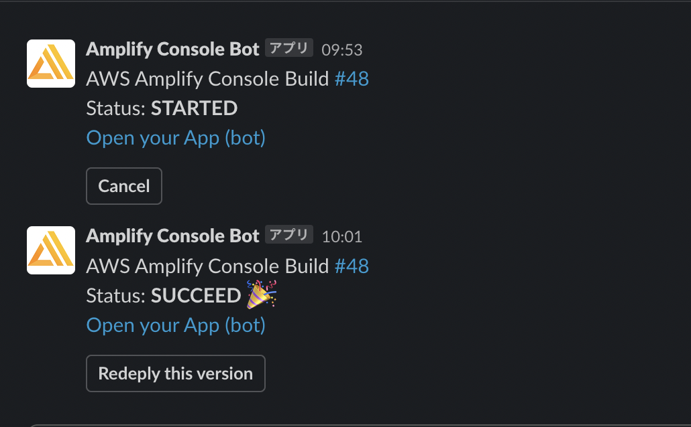
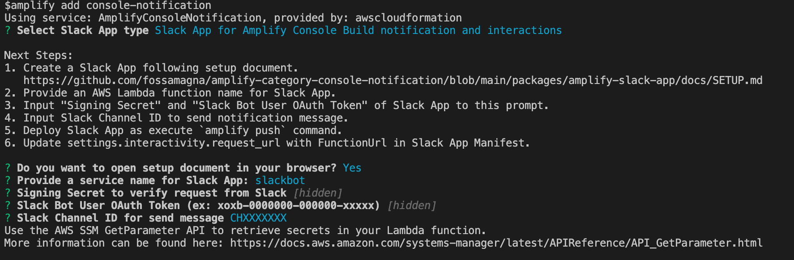

# Amplify ConsoleのSlackアプリ

Amplify Consoleのビルト結果をSlackに通知するAmplifyプラグインとして[amplify-category-console-notification][1]を公開しています。
最近、このプラグインにSlackアプリを追加しました。

[amplify-category-console-notification][1]のSlackアプリを追加すると次のことができるようになります。
- Amplify Consoleのビルド開始・終了時にSlackメッセージで通知を受け取る
- Slackメッセージからそのバージョンを再デプロイする
- SlackメッセージからAmplify Consoleのビルドをキャンセルする


*Slackに通知されたビルド結果*

このSlackアプリを追加する以前は、[SlackのIncoming Webhook](https://api.slack.com/messaging/webhooks#getting_started)（以降、Webhook版）を利用してSlackにビルド結果のメッセージを送信していました。
Webhook版はシンプルな構成でビルド結果の通知ができていましが、ビルドに対するアクションもSlack上からできると便利だと思い、Slackアプリ版を追加しました[^1]。

[^1]: Slackアプリ版を追加しましたが、Incoming Webhook版も引き続き利用可能です。

# Slackアプリを追加する

Slackアプリを追加（利用）するには、Amplifyプロジェクトで次のコマンドを実行して[amplify-category-console-notification][1]をインストールします。

```console
npm install -g amplify-category-console-notification amplify-slack-nodejs-function-template-provider
amplify plugin add $(npm root -g)/amplify-category-console-notification
```

インストールできたら、以下のコマンドでSlackアプリ追加を開始します。

```console
amplify add console-notification
```

コマンドを実行すると、Webhook版とSlackアプリ版のどちらを使うのか聞かれるのでSlackアプリを選択します。
Slackアプリを選択すると、Slackアプリを追加するの必要な手順がコンソールに表示されます。スクリーンキャプチャ付きのドキュメントのURLがコンソールに表示され、ブラウザでそのページが表示されるので、その手順に沿ってSlack APIのページでSlack Appを作成してください。実際の手順は[こちら](https://github.com/fossamagna/amplify-category-console-notification/blob/main/packages/amplify-slack-app/docs/SETUP.md)から確認できます。


*コンソールに表示されたSlackアプリを追加するの必要な手順*

Slack Appを作成すると、Slack APIのページで以下の値を確認できるようになります。コンソールのプロンプトでそれらの値の入力を求められるので入力してください[^2]。
- `Signing Secret`
- `Slack Bot User OAuth Token`
- `Slack Channel ID`

[^2]: 入力されたシークレット、トークンはAWS SSMに保存されます。

全て入力が完了したら、追加されたサービスのリソースをAWS上に作成します。
`amplify push`するか、すでにAmplify Consoleと連携済みであれば`git commit`＆`git push`をすることで実行できます。
これ以降は、Amplify Consoleでビルドする度に、Slackに通知のメッセージが送信されるようになります。

# フィードバックのお願い

Amplifyユーザーの方に使っていただいてフィードバックをいただけると嬉しいです。バグ報告や改善提案など[GitHubのIssue](https://github.com/fossamagna/amplify-category-console-notification/issues/new/choose)、[Twitter](https://twitter.com/fossamagna)、[Amplify Japan User GroupのSlack](https://github.com/aws-amplify-jp/awesome-aws-amplify-ja#slack)などでお待ちしています。

[1]:https://github.com/fossamagna/amplify-category-console-notification