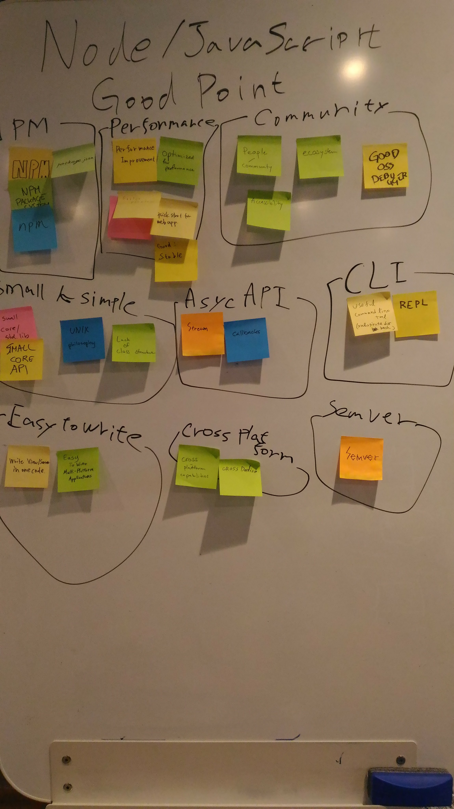

11月12日, 13日で開催された東京Node学園祭に参加してきました。昨年初参加で今年は2回目の参加です。
やっとブログ書く時間ができたので参加報告を書きます。

今年の東京Node学園祭は2日間の開催でした。セッション・LTの登壇者は両日とも参加費なしで参加できるということでありがたく両日もと参加させてもらいました。運営の方、太っ腹！ありがとうござます。

1日目はワークショップ中心でNodeSchool、Node Discussion、PayPal / Braintree Workshop、Code and Learn、LTという感じでした。

Node DiscussionではNode.js(JavaScript)に関してGood Point, Bad Point, Wishlistの切り口で思うところを付箋に書いて議論しました。
適宜通訳してくれてたので英語が得意でない自分としてはありがたかったです。
後日、Twitterを見ていると Wishlist に対する回答が [@bmeckの回答](https://gist.github.com/bmeck/acfa3f54e779d718f49f9ad2ec15aff7) から出ていました。当日付箋に書かれた内容一つ一つにちゃんと回答してくれていて本当にありがたいなと思います。私もNode.jsでアーカイブファイルがあるといいなということを書いたのですが、それに対しても回答があり、[node-loader](https://github.com/bmeck/noda-loader)というモジュール(知らなかった)やNode.jsでのやり取りにissueへのリンクもあってとても参考になりました。

Node Descussionで出た意見：

Code And Learn は実際に Node.js の core にコントリビュートしてみようというワークショップです。初めての人でも事前にコントリビュートできそうなポイントを[リストアップ](https://github.com/nodejs/code-and-learn/issues/58)されていたので、参加者がその中から自分が貢献できそうなものに対して実際に修正して Pull Request を出してみるというところまでを体験しました。
Pull Request を出すとTシャツがもらえるという特典付きだったので俄然やる気になりました！
私が出した Pull Request はテストコードの修正で `setTimeout()`の代わりに`setImmediate()`を使うようにするというものです。修正としてはとても小さいですが、実際にNode.jsのリポジトリに自分の修正が反映されるという体験ができたことは、自分でも Node.js 対して何かできるかもという気にさせられて、Node.jsへのコントリビュートって難しいよね〜というような心理的な部分での障壁が下がったと思います。

LTでは「Electronで製造ラインアプリ開発」というタイトルで発表をさせてもらいました。

緊張してうまく発表できなかったのが悔やまれますが、発表の後に興味を持って声をかけてくださった方々もいて、
発表させてもらえたおかげていろんな人と話す機会をもてたのは本当にうれしかったですね。

2日目は公演中心でした。私は Room A を中心に参加しました([動画が公開](https://nodejs.connpass.com/event/42182/presentation/)されたので Room B の講演は動画で見ます)。

2日目で一番衝撃的だったのは Douglas Crockford の Keynote です。HTTPでもHTTPSでもなく[Seif](http://www.theserverside.com/news/4500279472/Seif-project-makes-Web-security-a-priority)という新しいプロトコルの話でした。話のスケールが大きすぎで「えっ！？」と思うことがたくさんでした。

全体として今年は海外スピーカーの割合が多かったよう思います。でも、各セッションには通訳をしてくれるスタッフの方がいるので英語が苦手でもちゃんと聞くことができました。Keynote以外でも ES Module が Node.js にくるのはv10.xからの予定だとか、Node.js でも HTTP2の実装は進んでいるよだとか、ChooというFrameworkの紹介だったりとバラエティに飛んだ内容が盛りだくさんでした。

2日目は懇親会もあり、普段はなかなか会えないひとと直接話すよい機会でした。

1日目のLTを見て声をかけてくれた方や、Electron開発チームの Jacob Groundwater とも実際にLTで発表したアプリケーションを見ながら話をできたのはともてよい経験でした。Electronに対してのフィードバックはGitHubのissueなんかでどんどん書いて欲しいという感じでした。Twitterにつぶやくだけじゃなくてissueにして議論できるようなフィードバックを心がけたいと思いました。

それと、普段私は NodeSchool Fukui を主催していますが、NodeSchool Tokyoの [@kohei_takata](https://twitter.com/kohei_takata) と話をできたのは本当に良かったです。自分の思うところを伝えられたのと、今後の展望なんかも話せたのがともてよかった。これからも NodeSchool Fukui やっていこうという思いが強くなりました。

今年も参加して本当によかったと思います。たくさんの刺激をもらいました。去年は一般参加でしたが、今年はLTをすることができたしなかなか会えないけど話したいと思っていた人とも話せました(話せると思ってなかった人とも話せましたし)。2日間の開催でさらに大変だったと思います。運営の方々には本当に感謝です。
NodeSchool Fukuiでメンターをしているので来年の東京Node学園祭でもNodeSchoolを開催するのであればメンターとして協力できたらなと思いました。
また、来年の東京Node学園祭を楽しみにしています。来年までにはもっと英語を勉強しないと。。。