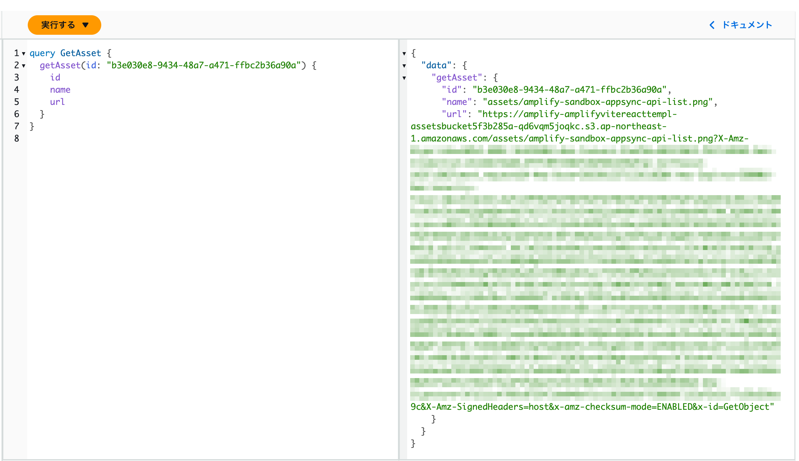

Amplify Gen2 でフィールドレベルのリゾルバーとして Lambda リゾルバーを追加する方法を紹介します。

## Amplify Gen1 の場合

Amplify Gen1 の頃は以下のように簡単にフィールドレベルのリゾルバーとして Lambda リゾルバーを追加することができました。

```graphql
type Asset @model {
  #
  # S3 Key of this asset
  #
  name: String!
  #
  # Type of this asset
  #
  type: String!
  #
  # Download URL for this asset
  #
  url: AWSURL! @function("assetUrl")
}
```

このように`@function`ディレクティブを`url`フィールドに指定すると、`url`フィールドを解決するリゾルバーとして`assertUrl`という Lambda が呼び出されるようになります。

## Amplify Gen2 の場合

これを、Amplify Gen2 の TypeScript を用いたスキーマ定義で書こうとすると以下のようなイメージです。
しかし、Amplify Gen2 でフィールドレベルのリゾルバーを追加する方法が提供されていません。
モデルのフィールドにカスタムリゾルバーを追加するための API が用意されていないからです。

```ts
import { a, defineData, defineFunction } from "@aws-amplify/backend";

const assetUrlHandler = defineFunction({
  entry: "./assetUrl-handler/handler.ts",
});

const schema = a.schema({
  Asset: a
    .model({
      name: a.string(),
      type: a.string(),
      // 実際には a.url().handler(...) のようなAPIはないので、このようには書けない
      url: a.url().handler(a.handler.function(assetUrlHandler)),
    })
    .authorization((allow) => [allow.publicApiKey()]),
});
```

上記のように、`a.url().handler(...)`のような記述でフィールドレベルに Lambda リゾルバーを設定することはできませんが、Amplify Gen2 は AWS CDK ベースなので、
次に紹介するように AWS CDK の API を利用して設定することが可能です。

### Step 1: ハンドラーとなる Lambda を実装する

最初に、フィールドレベルの Lambda ハンドラーを以下のように実装します。
以下のコードは S3 の署名付き URL を発行して、その URL を返す Lambda です。

`Asset.url`のリゾルバーからこの Lambda の`handler`関数が呼び出されます。その時に引数で`event`を受け取ります。
`event.source`を通して`Asset`のフォールドを取得できます（この後の Step でその設定をします）。
例えば`Asset.name`を取得する場合は`event.source.name`で取得できます。

`amplify/function/assetUrl.ts`:

```ts
import type { AppSyncResolverHandler } from "aws-lambda";
import { getSignedUrl } from "@aws-sdk/s3-request-presigner";
import {
  S3Client,
  GetObjectCommand,
  GetObjectCommandInput,
} from "@aws-sdk/client-s3";
import { env } from "$amplify/env/asset-url";

export const handler: AppSyncResolverHandler<unknown, string> = async (
  event,
  context
) => {
  if (!event.source) {
    throw new Error("Event source is not found.");
  }
  const client = new S3Client({
    region: env.AWS_REGION,
  });
  const params: GetObjectCommandInput = {
    Bucket: env.ASSETS_BUCKET_NAME,
    Key: event.source.name, // Asset.nameからS3のキーを取得
  };
  const command = new GetObjectCommand(params);
  return await getSignedUrl(client, command, { expiresIn: 3600 });
};
```

Lambda のコードが作成できたら`defineFunction`で Lambda 関数を定義します。

`amplify/function/resource.ts`:

```ts
import { defineFunction } from "@aws-amplify/backend";

const assetUrlHandler = defineFunction({
  entry: "./assetUrl.ts",
});
```

### Step 2: AppSync のリゾルバーを設定する

クエリーで`Asset.url`が指定された場合、上記の Lambda が呼び出されその値が解決されるようにします。

最初に、先ほど作成した Lambda を AppSnc のデータソースとして追加します。
次に、データソースとなる Lambda を呼び出す AppSync 関数を作成ます。
最後に、`Asset.url`のリゾルバーを追加し、上記の AppSync 関数を設定します。

`amplify/backend.ts`:

```ts
import { defineBackend } from "@aws-amplify/backend";
import type { AmplifyGraphqlApi } from "@aws-amplify/graphql-api-construct";
import { auth } from "./auth/resource";
import { data } from "./data/resource";
import { assetUrl } from "./function/resource";
import * as lambda from "aws-cdk-lib/aws-lambda";
import * as appsync from "aws-cdk-lib/aws-appsync";

const backend = defineBackend({
  auth,
  data,
  assetUrl,
});

// 1. Lambdaデータソースを追加
const dataSource = backend.data.addLambdaDataSource(
  "AssetUrlDataSource",
  backend.assetUrl.resources.lambda,
  {}
);

// 2. リゾルバーが呼び出す関数を追加
const appsyncFunction = backend.data.addFunction("AssetUrlFunction", {
  dataSource,
  name: "AssetUrlFunction",
  runtime: appsync.FunctionRuntime.JS_1_0_0,
  code: appsync.AssetCode.fromInline(`
export function request(ctx) {
  return {
    operation: 'Invoke',
    payload: {
      typeName: 'Asset',
      field: 'url',
      arguments: ctx.args,
      identity: ctx.identity,
      source: ctx.source,
      request: ctx.request,
      prev: ctx.prev,
    },
    invocationType: "RequestResponse"
  };
}
export function response(ctx) {
  return ctx.result
}
`),
});

// 3. リゾルバを追加
const resolver = backend.data.addResolver("AssetUrlResolver", {
  fieldName: "url",
  typeName: "Asset",
  pipelineConfig: [appsyncFunction],
  runtime: appsync.FunctionRuntime.JS_1_0_0,
  code: appsync.AssetCode.fromInline(`
export function request(ctx) {
  return {};
}
export function response(ctx) {
  if (ctx.error) {
    util.error(ctx.error.message, ctx.error.type);
  }
  return ctx.prev.result;
}
`),
});
```

以上で`Asset.url`フィールドに Lmabda リゾルバーを設定できました。

### デプロイ＆動作確認

AWS コンソールから以下のような AppSync のクエリを実行してみます。
`url`フィールドで発行された署名付き URL が取得できていることが確認できます。



ここで紹介したコードは[GitHub のリポジトリ](https://github.com/fossamagna/amplify-gen2-resolvers-sample)でも公開しています。参考にしてください。
