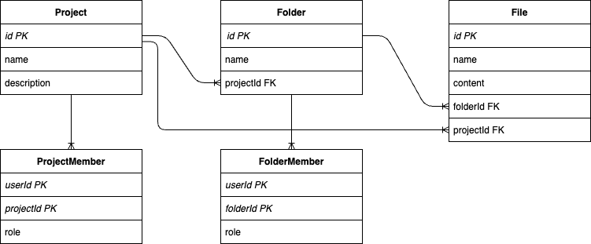
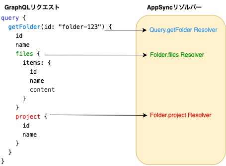
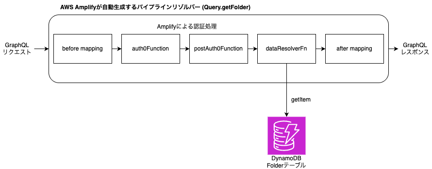
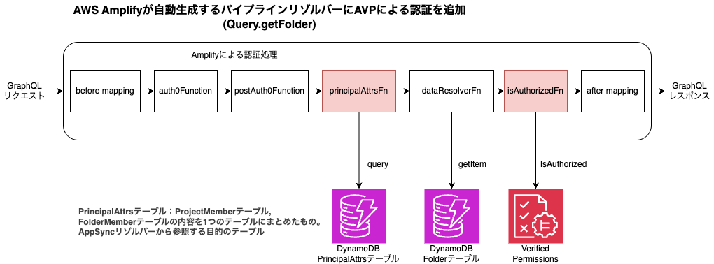
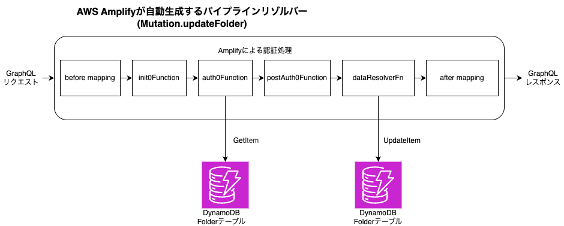
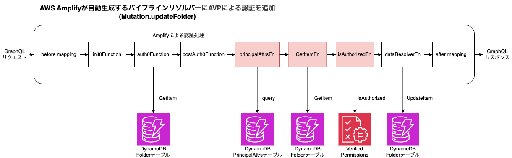

この記事は、2025年10月11日に開催された [JAWS FESTA 2025 in Kanazawa](https://jawsfesta2025.jaws-ug.jp/) での発表内容「Amazon Verified Permissions 実践入門 〜Cedar活用とAppSync導入事例〜」をベースにしたものです。

## 概要

Amazon Verified Permissions(AVP)とAWS AppSyncを組み合わせてどう使えるのかを事例ベースでご紹介します。Cedarの書き方から、AppSyncへの導入、テストの工夫まで、実際に使ってみてわかったポイントを紹介します。

## Amazon Verified Permissions を採用した背景

AWS Amplifyで開発しているアプリケーションに複雑な認可処理を実装する必要がありました。具体的には以下のような要件が発生しました。

- AWS Amplify 標準機能だけでは表現が難しく複雑な認可要件が発生
- 権限情報はアプリケーションのデータとして管理したい(属性ベースのアクセス制御)
- アプリロジックと認可を分離して実装したい(AWS Amplify が自動生成したコードも利用したい)

AWS Amplifyにはシンプルなユーザー認証以外に、[データの所有者や所有グループを定義してアクセス権を定義する機能](https://docs.amplify.aws/react/build-a-backend/auth/grant-access-to-auth-resources/)があります。しかし、今回のアプリケーションではデータが個人の所有ではなく所属する組織のものであることや、アクセス権をきめ細やかにコントロールする必要がありました。[^1]

[^1]: AWS Amplify では AppSync（GraphQL）のサブスクリプションを利用する場合、ユーザーの所属するグループ数に上限が最大20までという制約も存在しました。そのため、AWS Amplifyの標準機能だけでは対応できませんでした。

そこで、複雑な認可処理にも対応しアプリのビジネスロジックとも分離して実装が進められるということで、認可処理にはAmazon Verified Permissionsを採用しました。

## Amazon Verified Permissions(AVP) と Cedar

AVPは[Cedar](https://www.cedarpolicy.com/)という言語で定義するポリシーセットを管理・評価する認可処理に特化したマネージドサービスです。

### Cedarポリシー言語の特徴

Cedarでは特定ユーザーによる特定の操作が許可されるかどうかを事前に定義されたポリシーセットによって判断します。以下のようなCedar言語でポリシーを定義します。

```cedar
permit(
  principal in Group::"Viewrs",
  action == Action::"read",
  resource == File::"144887AF-402E-4BC3-897E-3A62F38CC8D7"
);
```

ポリシーはリソースに対するアクションの実行を明示的に許可または禁止するプリンシパルを宣言する形で定義します。

例えば、上記のポリシーはIDが`144887AF-402E-4BC3-897E-3A62F38CC8D7`のFileに対する`read`アクションを`Viewers`というグループに含まれるprincipalに許可(permit)する定義です。同様に許可しないポリシーは`forbid`で定義します。

ポリシーに記述する、プリンシパル、アクション、リソースがどういったものなのかは開発者がスキーマで自由に定義できます。

### 認可判定の仕組み

AVPでは、このように定義したポリシーのセットを登録し、認可の判定が必要な際は`IsAuthorized`というAPIで問い合わせることで判定結果を`allow`または`deny`という値で得ることできます。

## アプリケーションのデータ構造

この記事で対象とするアプリケーションのデータモデルについて説明します。
アプリのデータは Project, Folder, File がそれぞれ 1対多の関係をもつ階層構造となっています。



そして、ProjectMember で Project に対するユーザーとそのロール(`owner`, `contributor`, `viewer`)、 FolderMember で Folder に対するユーザーとロールを管理します。

例えば、ProjectMemberにviewerとして追加されたユーザーは対応するProjectとその配下のFolder、File全てを参照する権限が付与されます。一方、FolderMemberにviewerとして追加されたユーザーはFolderとその配下のFileに対する参照権限のみが付与されます。階層構造の親にあたるProjectへの参照権限は付与されません。

## 属性ベース(ABAC)のポリシー定義

このようなデータモデルに対してどういったポリシーを定義して対応したのかを説明します。

今回のモデルではProjectMemberでProject（とその配下）、FolderMemberでFolder（とその配下）のリソースにどのユーザーがアクセスできるかを管理します。特定のユーザーがProjectAに対してowner権限をもち、ProjectB配下のFolderBにはviewer権限を持つというような複雑な権限を表現する必要があります。

データモデルのProjectMember、FolderMemberの情報をCedarのポリシーではユーザー(principal)の属性（viewerProjects、viewerFolders）として表現するようにしました。他にもownerProjects, contributorProjectsのような属性も存在します。

以下は、principal.viewerProjects に含まれる Project 配下の Folder、または、principal.viewerFolders に含まれる Folder に対して`Query.getFolder`というアクションを許可するポリシーの例です。

```cedar
permit (
  principal,
  action == Action::"Query.getFolder",
  resource
) when {
  resource in principal.viewerProjects || resource in principal.viewerFolders
};
```

ユーザーの属性（viewerProjects、viewerFolders）にはアクセスの権限のあるProjectやFolderのIDを保持します。ポリシーでは`when`で対象リソースがこれらのユーザー属性に含まれている場合という条件を付加しています。つまり`when`で指定した条件を満たすとFolderのデータを取得する`Query.getFolder`というアクションが許可されることになります。

このようにデータモデルで管理しているProjectMember、FolderMemberをユーザー属性として表現することでリソースへのきめ細やかなアクセスコントロールを実現しました。

Cedarのプラクティスとして権限に関する情報をCedar以外のストアで管理し、リソースへのきめ細やかなアクセスコントロールを必要とする場合はABACが適しているとされています。それも踏まえCedarのポリシーとして定義する際に、属性ベースのポリシーとして定義することにしました。

### AVP(IsAuthorized) のリクエスト

先ほどのポリシーを定義して、実際に認可チェックを行う場合のリクエストは以下のようなJSONです。

```json
{
  "principal": { "entityType": "App::User", "entityId": "fossamagna" },
  "action": { "actionType": "Action", "actionId": "Query.getFolder" },
  "resource": { "entityType": "App::Folder", "entityId": "folder-123" },
  "entities": {
    "entityList": [
      { 
        "identifier": { "entityType": "App::Folder", "entityId": "folder-123" },
        "parents": [{ "entityType": "App::Project", "entityId": "project-123" }] 
      },
      {
        "identifier": { "entityType": "App::User", "entityId": "fossamagna" },
        "attributes": {
          "viewerProjects": {
            "set":[{
              "entityIdentifier": { "entityType": "App::Project", "entityId": "project-123" }
            }]
          }
        }
      }
    ]
  },
  "policyStoreId": "PSEXAMPLEabcdefg111111"
}
```

プリンシパルにはそのタイプとID、アクションにはフォルダの情報を取得する`Query.getFolder`、対象はIDが`folder-123`のFolderを指定しています。

そして、`entityList`でエンティティ(プリンシパルとリソース)のリストを指定します。ここで`parents`でエンティティ同士の階層構造を表現します。今回だとProject配下にFolderが存在する階層構造なので、IDが`folder-123`のFolderの親として`project-123`のProjectを設定しています。

また、エンティティは属性を持つことができます。Userにはアクセス権を持ったProject、FolderのIDを属性として保持するようにしています。この例では`viewerProjects`にIDが`project-123`のProjectを保持して、そのプロジェクトにviewer権限を持っていることを表現しています。

先ほどのポリシーではこの`viewerProjects`に対象リソースもしくはその親が含まれているかをポリシー適用の条件としていました。この例では対象リソースのID：`folder-123`のFolderの親となるprojectが`viewerProjects`に含まれているのでポリシーが適用されて認可チェックとしてOKの判断となります。

### AVP(IsAuthorized) のレスポンス

認可チェックの結果は以下のようなJSONで取得できます。

```json
{
  "determiningPolicies": [
    {
      "PolicyId": "SPEXAMPLEabcdefg111111"
    }
  ],
  "decision": "ALLOW",
  "errors": []
}
```

`decision`に`ALLOW`があれば認可チェックOK（許可）となり、`DENY`であれば認可チェックNG（NGはリクエストの条件を満たすpermitのポリシーがないか条件を満たすforbidのポリシーがあった場合です）となります。

## AWS Amplify Gen2 / AppSync 概要

AVPを利用してアプリのモデルに必要な認可のポリシーをどう定義しチェックするかを説明したので、次にこのチェックをアプリのAPIにどう組み込んだかを説明します。

### AWS Amplify Gen2とAppSyncの特徴

- **AWS Amplify Gen2**: TypeScript でインフラ/データ API を宣言、すぐに AppSync にデプロイして API を構築可能
- **AppSync**: GraphQL API、パイプラインリゾルバーで任意の処理をパイプライン状に繋げて実装できる（ビジネスロジックの前後に認可を挿入しやすい）
- **データソース**: DynamoDB / HTTP / Lambda / RDS など

AWS AmplifyのAPIはAppSyncのGraphQL APIです。AppSyncはクライアントからのGraphQLリクエストを処理するリゾルバーとしてパイプラインリゾルバーという機能を利用できます。これは任意の処理をパイプライン状に繋げてリクエスト処理することができるものです。そして、このパイプライン内の処理からDynamoDBやAWSサービスを含むHTTPエンドポイントにアクセスしたりLambdaを呼び出したりすることができます。

## AppSync のリゾルバーの動作と認可処理の実装方針

次の図は、`getFolder`というIDを指定してFolderを取得するクエリのGraphQLリクエストに対してAppSyncのリゾルバーがどう動くのかを表しています。Folderの`files`、`project`はそれぞれFolderに関連するFileのコレクションと親Projectを取得できるフィールドです。



AppSync は GraphQL リクエストに対してフィールド毎に対応するリゾルバーを呼び出します：

- `getFolder` → `Query.getFolder`
- `files` → `Folder.files`
- `project` → `Folder.project`

この図ではIDが`folder-123`のFolderを取得するリクエストを表しています。`folder-123`のFolderに対する参照権限のみをもつユーザーからこのGraphQLリクエストを受けた場合、AppSyncの`Query.getFolder`と`Folder.files`のリゾルバーは指定されたデータを返しますが、`Folder.project`のリゾルバーはProjectの値を返してはいけません。それは、Folderを参照する権限のみしかなくProjectを参照する権限がないからです。

このようにリゾルバー毎にそのデータに対する権限があるかの認可チェックを行う必要があります。

## AVPを組み込んだパイプラインリゾルバーの実装

では、`Query.getFolder`のリゾルバーを例にAVPの認可処理をAppSyncのリゾルバーでどう実装するか詳しく説明します。

### 自動生成される Query.getFolder のパイプラインリゾルバー

Amplifyはこのようなパイプラインリゾルバーを自動生成します：

1. Amplify(Cognito)の認証
2. DynamoDB からのデータ取得



AppSyncのパイプラインリゾルバーでは図で四角で表現しているAppSync関数を順番に呼び出してリゾルバーの処理を実現します。AppSync関数はTypeScript/JavaScript、VTLで実装できます。AppSync関数からはDynamoDB、Lambda、HTTP API、RDS（のData API）などと接続したDataSourceに対するリクエストを作成することでデータの取得や更新などを実行できます。

### 認可処理を追加した Query.getFolder のパイプラインリゾルバー

先ほどのAmplifyが自動生成するパイプライン処理にAVPの認可処理を追加します。



赤色背景の四角になっている`principalAttrsFn`と`isAuthorizedFn`が追加のAppSync関数です：

1. **principalAttrsFn**: AVP へのリクエストに含める Principal の属性情報を取得する関数。ここで取得した値は後続の`isAuthorizedFn`で利用します。
2. **dataResolverFn**: Amplifyが生成したAppSync関数。DynamoDBからデータを取得します。このパイプラインリゾルバーはFolderを取得する処理なのでDynamoDBのFolderテーブルから値を取得します。
3. **isAuthorizedFn**: AVPに対して認可チェックを行う`IsAuthorized`のHTTPリクエストを行います。`principalAttrsFn`で取得したPrincipalの属性情報と前段の`dataResolverFn`で取得したFolderを合わせて、このGraphQLリクエストを送信したユーザー（Principal）が対象Folderを参照できるのかをチェックします。

この結果が`ALLOW`であれば後続の処理を実行（つまり、前段で取得したFolderを返す処理を）しますが、`DENY`であったりエラーであったりした場合はエラーで終了し、取得したFolderはレスポンスで返しません。

データを取得するQuery系のリゾルバーはこれと同様のパイプラインリゾルバーの構成で認可処理を実装できます。

### Mutation.updateFolder のパイプラインリゾルバー

次に、データを登録、更新、削除するMutationのパイプラインリゾルバーです。`Folder`を更新する`Mutation.updateFolder`のリゾルバーを例に説明します。

Amplifyが自動生成するパイプラインリゾルバーは以下のようになります：



1. Amplify(Cognito)の認証チェック
2. `auth0Function`: 認証済みであればDynamoDBテーブルから値を取得（更新対象データの存在チェック）
3. `dataResolverFn`: UpdateItemでDynamoDBの対象レコードを更新

### 認可処理を追加した Mutation.updateFolder のパイプラインリゾルバー

先ほどのAmplifyが自動生成するパイプライン処理にAVPの認可処理を追加します。



赤色背景の四角になっている`principalAttrsFn`、`GetItemFn`[^2]、`isAuthorizedFn`の3つが追加のAppSync関数です。

`Query.getFolder`と違い、`isAuthorizedFn`はデータ更新処理（`dataResolverFn`）より前に実行します。`Query.getFolder`はデータの参照のみなので副作用はありませんが、`Mutation.updateFolder`の`dataResolverFn`は更新処理なので、実際に更新する権限があるかの認可チェックはその前に行う必要があるためです。`principalAttrsFn`、`isAuthorizedFn`は`Query.getFolder`と同じです。

[^2]: 今回は更新対象のデータ取得をAmplifyが自動生成したAppSync関数ではなく`GetItemFn`として追加しました。`auth0Function`で同じデータをDynamoDBから取得していますが、Amplifyが生成する実装はここで取得した値を後続で利用できるようにはなっていなかったので、別途`GetItemFn`として追加しています。

Mutation系の実装はこのようなパイプラインリゾルバーの構成で実装できます。なお、Subscriptionも若干複雑にはなりますが、Mutationと同じような考え方で実装ができます。

このようにAppSyncのパイプラインリゾルバーを利用してAVPをAPIに統合することができます。

## Cedar ポリシーの自動テスト

開発をしていくとポリシーの数も増え、様々なパターンのポリシーを追加・修正、削除します。これらのポリシーが期待した結果を生むのか、ポリシー追加・修正・削除時にデグレしないかをテストする必要があります。手動ではデータの準備・実施など大変なので、ポリシー自体の自動テストを実装するのをお勧めします。

`@cedar-policy/cedar-wasm`を利用すると`IsAuthorized`を実行可能で、`vitest`などと組み合わせて自動テストでポリシーのテストが可能です。

```ts
import { test, expect } from "vitest";
import * as cedar from "@cedar-policy/cedar-wasm/nodejs";

test("FolderMemberにviewerで登録された場合、Query.getFolderの認可判定がALLOWになること", () => {
  const policies = new cedar.PolicySet(/* Cedar policy text */);
  const result = cedar.isAuthorized({
    principal: { type: "User", id: "fossamagna" },
    action: { type: "Action", id: "Query.getFolder" },
    resource: { type: "Folder", id: "folder-123" },
    entities: {...},
    policies,
  });
  expect(result.response.decision).toBe("allow");
});
```

テストの実行速度は非常に早いのでwatchモードで常にテストを動かしながらポリシー変更をしてデグレしていないか、期待した結果になるか確認しながら実装を進めることができます。CIでも動かしているので安心感があります。

## まとめ

Amazon Verified PermissionsとCedarポリシー言語を活用することで、AWS Amplify Gen2 / AppSyncに複雑な認可処理を統合することができました。

### 主なポイント

- **AVP/Cedar により複雑なモデル・認可ルールに対応可能**: 属性ベース(ABAC)のアクセス制御により、階層構造を持つデータモデルに対してきめ細やかなアクセスコントロールを実現
- **AppSync パイプラインリゾルバーで認可処理を追加可能**: DynamoDB データソース、HTTP データソースにより低遅延を実現（初期実装は Lambda リゾルバー + AppSync API 呼び出しを利用したため性能問題が発生）
- **ポリシーとアプリロジックが分離される**: 並行開発が可能で、それぞれのチームが独立して作業できる
- **Cedar ポリシーをテスト自動化で品質を担保**: `cedar-wasm`を利用した自動テストでポリシーの品質を維持

複雑な認可要件を持つアプリケーションを開発する際には、Amazon Verified Permissionsの採用を検討する価値があります。特に以下のようなケースで有効だと思います。

- 標準的な認証・認可機能では表現が難しい複雑なアクセス制御が必要
- 権限情報をアプリケーションデータとして柔軟に管理したい
- ビジネスロジックと認可ロジックを分離して保守性を向上させたい

## 参考資料

本記事の内容をより深く理解するために、以下のリソースを参照してください。

- **サンプルリポジトリ**(この記事の内容を実際に動かして確認可能です): [github.com/fossamagna/amplify-verified-permissions-examples](https://github.com/fossamagna/amplify-verified-permissions-examples)
- [Amazon Verified Permissions ユーザーガイド](https://docs.aws.amazon.com/ja_jp/verifiedpermissions/latest/userguide/what-is-avp.html)
- [Cedar policy language](https://www.cedarpolicy.com/)
- [AWS AppSync GraphQL デベロッパーガイド](https://docs.aws.amazon.com/ja_jp/appsync/latest/devguide/what-is-appsync.html)

