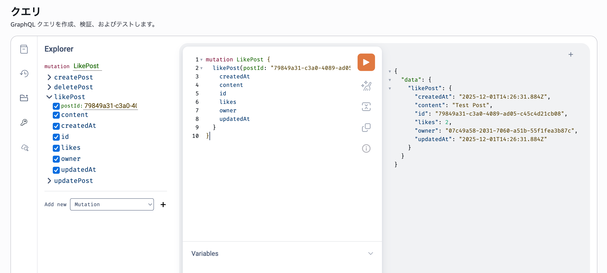

この記事は[AWS Amplify と AWS× フロントエンド #AWSAmplifyJP Advent Calendar 2025](https://qiita.com/advent-calendar/2025/amplify), [AWS Community Builders Advent Calendar 2025 シリーズ 2](https://qiita.com/advent-calendar/2025/aws-community-builders), [ESM Advent Calendar 2025](https://adventar.org/calendars/12097) の 2 日目の記事です。

## はじめに

Amplify Gen2 ではスキーマ定義をもとに自動生成されるリゾルバー以外にカスタムリゾルバーも実装できます。
[公式ドキュメント](https://docs.amplify.aws/react/build-a-backend/data/custom-business-logic) では Lambda と AppSync JavaScript(以降、JS リゾルバー) での実装方法が紹介されています。以前は VTL で実装する必要があったのですが JavaScript でも実装できるようになりました。

VTL と比べて JavaScript で実装できるようになったので随分読み書きしやすくなりました。
ただ、ある程度のコード量を実装しようとすると JavaScript ではなく型のある TypeScript で実装したくなります。

この記事では、TypeScript で Amplify Gen2 のカスタムリゾルバーを実装する方法を紹介します。
公式ドキュメントで紹介されている JS リゾルバーの実装を引用して、それを TypeScript での実装に変える流れで説明したいと思います。

## JS カスタムリゾルバー

まず、公式ドキュメントでは以下のようにスキーマ定義がされています。

`amplify/data/resoruce.ts`:

```ts
import { type ClientSchema, a, defineData } from "@aws-amplify/backend";

const schema = a.schema({
  Post: a
    .model({
      content: a.string(),
      likes: a
        .integer()
        .authorization((allow) => [allow.authenticated().to(["read"])]),
    })
    .authorization((allow) => [
      allow.owner(),
      allow.authenticated().to(["read"]),
    ]),

  likePost: a
    .mutation()
    .arguments({ postId: a.id() })
    .returns(a.ref("Post"))
    .authorization((allow) => [allow.authenticated()])
    .handler(
      a.handler.custom({
        dataSource: a.ref("Post"),
        entry: "./increment-like.js",
      })
    ),
});

export type Schema = ClientSchema<typeof schema>;

export const data = defineData({
  schema,
  authorizationModes: {
    defaultAuthorizationMode: "apiKey",
    apiKeyAuthorizationMode: {
      expiresInDays: 30,
    },
  },
});
```

このスキーマ定義では、以下の部分で`listPost`というカスタムミューテーションを定義しています。
注目するのは`a.handler.custom()`の`entry: './increment-like.js'`の部分です。この`entry`で JS リゾルバーを実装した JS ファイルのパスを指定します。

```ts
likePost: a.mutation()
  .arguments({ postId: a.id() })
  .returns(a.ref("Post"))
  .authorization((allow) => [allow.authenticated()])
  .handler(
    a.handler.custom({
      dataSource: a.ref("Post"),
      entry: "./increment-like.js",
    })
  );
```

では、`./increment-like.js`の実装はというと、次のようになっています。

`amplify/data/increment-like.js`:

```js
import { util } from "@aws-appsync/utils";

export function request(ctx) {
  return {
    operation: "UpdateItem",
    key: util.dynamodb.toMapValues({ id: ctx.args.postId }),
    update: {
      expression: "ADD likes :plusOne",
      expressionValues: { ":plusOne": { N: 1 } },
    },
  };
}

export function response(ctx) {
  return ctx.result;
}
```

`request`関数で引数で指定された`postId`の`Post.likes`をインクリメントために DynamoDB の`UpdateItem`のリクエスト[^1]を作成しています。
`response`関数は DataSource(この例では DynamoDB の`Post`テーブル)からのレスポンスから結果を取り出しています。

[^1]: `update.expression`について詳しくは [DynamoDB での更新式の使用](https://docs.aws.amazon.com/ja_jp/amazondynamodb/latest/developerguide/Expressions.UpdateExpressions.html#Expressions.UpdateExpressions.ADD) を見てください。

## TypeScript に置き換える

ここまでで公式ドキュメントで紹介されている JS リゾルバーの実装内容を確認しました。これを TypeScript で実装できるようにしていきます。
スキーマ定義の`a.handler.custom()`の`entry: './increment-like.js'`の部分が JS リゾルバーの JS ファイルのパスになっているので、この`entry`に TypeScript で実装たリゾルバーをビルドした JS ファイルのパスを指定すればいいはずです。

AppSync の JS リゾルバーを TypeScript で実装する方法自体は AppSync のドキュメント[^2]に書かれています。ポイントは次の 2 つです。

- esbuild でビルド＆バンドルする
- Amplify の型定義を利用する

それぞれ、説明していきます。

[^2]: AppSync 公式ドキュメントの [APPSYNC_JS ランタイムのバンドル、TypeScript、ソースマップ](https://docs.aws.amazon.com/ja_jp/appsync/latest/devguide/additional-utilities.html) に詳しく書かれています。

### ディレクトリ構成

esbuild でのビルドの話をする前に JS リゾルバーで必要なファイルのディレクトリ構成を決めておきます。
JS リゾルバーに関するディレクトリ構成は以下のようにします。
JS リゾルバーの TypeScript ファイルは`amplify/data/resolvers`ディレクトリ配下に置きます。ビルドした結果の JavaScritp ファイルは`build/data/resolvers`ディレクトリ配下に出力します。
開発者は`amplify/data/resolvers`ディレクトリ配下に TypeScript ファイルを置いて実装し、ビルドした JavaScript ファイルは`build/data/resolvers`ディレクトリ配下に出力するイメージです。

```
/
├── amplify
│    ├── backend.ts
│    └── data
│         ├── resource.ts
│         ├── build-helper.ts
│.        └── resolvers
│              ├── tsconfig.json
│              └── increment-like.ts
└── build
      └── data
            └── resolvers
                  └── increment-like.js
```

厳密にこれと同じ構成にする必要はないのですが、ビルド結果の出力先ディレクトリをどこにするかは注意が必要です。ビルド結果を`amplify`ディレクトリ配下に置くと出力した JS ファイルの変更を検知して再度 CDK のデプロイが実行されてしまうので`amplify`ディレクトリ外に出力するようにします。

### esbuild でビルドする

ディレクトリ構成が決まったので、TypeScript のビルドができるようにしていきます。公式ドキュメントに従い TypeScript のビルドには esbuild を使います。
esbuild でビルド＆バンドルを実行して、出力した JS ファイルへのパスを返す以下のようなヘルパー関数を作成します。

まず、esbuild と Node.js の型定義を開発依存にインストールします。[^3]

```sh
npm install -D @types/node esbuild
```

[^3]: Amplify Gen2 を使っていれば esbuild はすでにインストールされているはずですが、`@types/node`は別途インストールが必要です。

`amplify/data/build-helper.ts`:

```ts
import esbuild from "esbuild";
import path from "node:path";
import fs from "node:fs/promises";

const __dirname = path.dirname(new URL(import.meta.url).pathname);

export async function build(key: string) {
  const outdir = path.join(
    __dirname,
    "..",
    "..",
    "build",
    "data",
    path.dirname(key)
  );

  const outfile = `${path.basename(key, path.extname(key))}.js`;

  const result = await esbuild.build({
    bundle: true,
    write: false,
    outfile: path.join(outdir, outfile),
    entryPoints: [path.join(__dirname, key)],
    format: "esm",
    platform: "node",
    target: "esnext",
    sourcemap: "inline",
    sourcesContent: false,
    tsconfigRaw: await fs.readFile(
      path.join(__dirname, "resolvers", "tsconfig.json"),
      "utf-8"
    ),
    external: ["@aws-appsync/utils"],
  });
  if (result.errors.length) {
    throw new Error("Could not build" + key + ": " + result.errors.join("\n"));
  }
  await fs.mkdir(path.dirname(result.outputFiles[0].path), { recursive: true });
  await fs.writeFile(result.outputFiles[0].path, result.outputFiles[0].text);
  return result.outputFiles[0].path;
}
```

esbuild でビルドする際の設定として`tsconfig.json`も合わせて作成します。
`amplify/data/resolvers/tsconfig.json`:

```json
{
  "compilerOptions": {
    "target": "esnext",
    "module": "esnext",
    "noEmit": true,
    "moduleResolution": "node",
    "esModuleInterop": true
  }
}
```

### backend.ts の修正

ヘルパー関数を作成したら、以下のように`amplify/backend.ts`のスキーマ定義で、`entry`に JavaScript ファイルのパスを直接指定する代わりに`build`関数を呼び出し結果を指定するようにします。

```ts
likePost: a.mutation()
  .arguments({ postId: a.id() })
  .returns(a.ref("Post"))
  .authorization((allow) => [allow.authenticated()])
  .handler(
    a.handler.custom({
      dataSource: a.ref("Post"),
      entry: await build("./resolvers/increment-like.ts"),
    })
  );
```

これで、TypeScript ファイルをビルドした JS ファイルをデプロイする準備ができました。

### JS リゾルバーを TypeScript に書き換える

次は、以下のように JS リゾルバーを TypeScript で実装します。
もとの JavaScript リゾルバーの実装との差分は`Context`の型を指定しただけですが、TypeScript で実装した JS リゾルバーがデプロイできるかの確認には十分です。

`amplify/data/resolvers/increment-like.ts`:

```ts
import { type Context, util } from "@aws-appsync/utils";

export function request(ctx: Context) {
  return {
    operation: "UpdateItem",
    key: util.dynamodb.toMapValues({ id: ctx.args.postId }),
    update: {
      expression: "ADD likes :plusOne",
      expressionValues: { ":plusOne": { N: 1 } },
    },
  };
}

export function response(ctx: Context) {
  return ctx.result;
}
```

AppSync の JS リゾルバーの型定義が必要なので以下のモジュールをインストールします。[^4]

[^4]: [@aws-appsync/utils](https://www.npmjs.com/package/@aws-appsync/utils)には型定義だけでなくユーティリティ関数も含まれているので JS リゾルバーを実装していく場合にはいずれ必要になるモジュールのはずです。

```sh
npm install @aws-appsync/utils
```

## デプロイと動作確認

あとは通常通り Amplify Gen2 のバックエンドをデプロイすれば、TypeScript で実装したカスタムリゾルバーがデプロイされます。

以下のコマンドで sandbox 環境にデプロイして、AppSync コンソールから`likePost`ミューテーションを実行できるはずです。

```sh
npx ampx sandbox
```



### Amplify の型定義を利用する

TypeScript で JS リゾルバーを実装するまでできるようになりました。次に Amplify の型定義を利用します。
AppSync の公式ドキュメントは Amplify Gen1 の場合[^5]を利用した場合の説明になっています。
Amplify Gen2 を利用する場合、スキーマ定義自体を TypeScript でしているので、そのスキーマ定義の型を JS リゾルバーの TypeScript でも利用できます。

[^5]: Amplify Gen1 ではスキーマは SDL で定義するので、TypeScript の型定義は amplify/cli を使って SDL で定義したスキーマから TypeScript の型定義を生成して利用する説明がされています。

以下が、Amplify のスキーマ定義の型を利用したバージョンです。
`amplify/data/resolvers/increment-like.ts`:

```ts
import { type Context, util } from "@aws-appsync/utils";
import type { Schema } from "../resource";

type Args = Schema["likePost"]["args"];
type Result = Schema["likePost"]["returnType"];
type Stash = Record<string, never>;
type Pre = Record<string, never>;
type Source = Record<string, never>;

export function request(ctx: Context<Args, Stash, Pre, Source, Result>) {
  return {
    operation: "UpdateItem",
    key: util.dynamodb.toMapValues({ id: ctx.args.postId }),
    update: {
      expression: "ADD likes :plusOne",
      expressionValues: { ":plusOne": { N: 1 } },
    },
  };
}

export function response(ctx: Context<Args, Stash, Pre, Source, Result>) {
  return ctx.result;
}
```

`Schema["likePost"]["args"]`のようにするとミューテーションの引数の型を参照できるので、それを`Context`の型パラメータに指定すると`ctx.arg`にスキーマで定義した引数の型が適用されます。
`Context`には他にも stash, pre, source, result の型をパラメータで指定できるので必要に応じて指定するとさらに型の恩恵を受けられると思います。[^6]

[^6]: `Context`に何が含まれるのかは [AWS AppSync JavaScript リゾルバーコンテキストオブジェクトリファレンス](https://docs.aws.amazon.com/ja_jp/appsync/latest/devguide/resolver-context-reference-js.html) も合わせて確認するとよいです。

## まとめ

esbuild でビルド＆バンドルを実行するヘルパーを作成すると Amplify Gen2 でも AppSync の JS リゾルバーを TypeScript で実装できます。
そして、Amplify Gen2 は TypeScript でスキーマ定義をするのでそのまま JS リゾルバーでもその型が利用できて便利です。
この記事で紹介した内容は https://github.com/fossamagna/amplify-ts-resolver-example で公開しています。git clone して動きを確認することもできるので JS リゾルバーを実装する時にはぜひ試してみてください。
