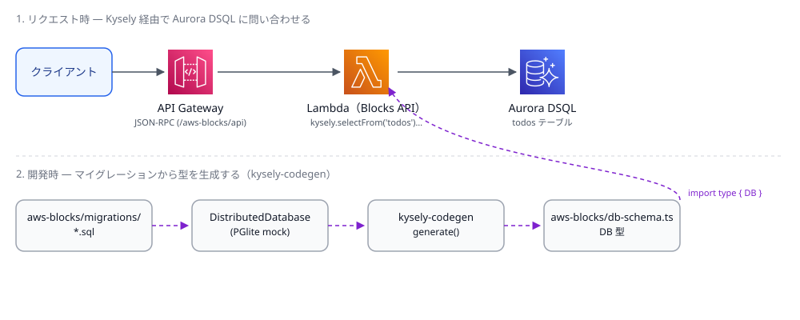

[AWS Blocks](https://www.npmjs.com/package/@aws-blocks/blocks) は TypeScript だけでバックエンドとインフラをまとめて定義できる AWS のツールキットです。以前 [TanStack Start の SSR をホスティングする記事](/blog/hosting-tanstack-start-ssr-on-aws-blocks) を書きましたが、今回は RDB を使う Building Block [DistributedDatabase](https://github.com/aws-devtools-labs/aws-blocks/tree/main/packages/bb-distributed-data) についてです。この Block を触っていて、生 SQL のままだとテーブル名や列名のタイプミスが実行するまで分からないことに気づきました。TypeScript 向けの SQL クエリビルダである Kysely を組み合わせると、この手のミスをコンパイル時に検出できます。さらに [kysely-codegen](https://github.com/RobinBlomberg/kysely-codegen) を使うと、マイグレーションの SQL ファイルから Kysely の型定義を自動生成できて、テーブル定義が変わってもTypeScriptの型も追従できます。

この記事では、この3つの組み合わせを動く最小構成のサンプルで紹介します。

https://github.com/fossamagna/aws-blocks-kysely-example

## AWS Blocks の RDB Block `DistributedDatabase`

AWS Blocks で SQL を使う Building Block には `Database`（Aurora Serverless v2）と `DistributedDatabase`（Aurora DSQL）の2種類があります。外部キーやトリガー、Row Level Security が必要なら `Database`、そこまでの機能が不要でコールドスタートやアイドルコストを避けたいなら `DistributedDatabase` を使う、とドキュメントには書かれています。今回は最小構成で試したいので `DistributedDatabase` を使います。
尚、`Database`を利用した場合も同様にKyselyを利用できます。

`create-blocks-app` の backend テンプレートに、todo テーブルを1つ持つ `DistributedDatabase` を追加しました。

```sh
npx @aws-blocks/create-blocks-app my-app --template backend
```

マイグレーションはプレーンな SQL ファイルです。

```sql
-- aws-blocks/migrations/001_create_todos.sql
CREATE TABLE todos (
  id TEXT PRIMARY KEY DEFAULT gen_random_uuid(),
  title TEXT NOT NULL,
  done BOOLEAN NOT NULL DEFAULT false,
  created_at TIMESTAMP DEFAULT CURRENT_TIMESTAMP
);
```

`npm run dev` すると、このマイグレーションはローカルの PGlite（WASM 版 Postgres）に適用されます。デプロイすると同じマイグレーションが実際の Aurora DSQL クラスタに適用されます。ローカルとデプロイ後で挙動が変わらないよう、DSQL がサポートしない機能（外部キーや SERIAL など）はローカルのモック側でも弾かれるようになっています。

## Kysely を組み合わせる

`DistributedDatabase` は生 SQL を投げる `query()` / `execute()` と、トランザクション用の `transaction()` を持っていますが、それとは別に `createKyselyAdapter()` というヘルパーが用意されていて、これを呼び出すと以下のように Kysely のインスタンスが手に入ります。

```typescript
// aws-blocks/index.ts
import { ApiNamespace, Scope, DistributedDatabase } from '@aws-blocks/blocks';
import { createKyselyAdapter } from '@aws-blocks/bb-distributed-data';
import type { DB } from './db-schema';

const scope = new Scope('aws-blocks-kysely-example');

const db = new DistributedDatabase(scope, 'db', {
  migrationsPath: './aws-blocks/migrations',
});

const kysely = createKyselyAdapter<DB>(db);

export const api = new ApiNamespace(scope, 'api', () => ({
  async listTodos() {
    return kysely.selectFrom('todos').selectAll().orderBy('created_at', 'desc').execute();
  },

  async addTodo(title: string, priority?: number) {
    return kysely.insertInto('todos').values({ title, priority }).returningAll().executeTakeFirstOrThrow();
  },

  async completeTodo(id: string) {
    return kysely
      .updateTable('todos')
      .set({ done: true })
      .where('id', '=', id)
      .returningAll()
      .executeTakeFirstOrThrow();
  },
}));
```

生 SQL で書くと、以下のようなコードになります。
テーブル名や列名は単なる文字列なので、タイプミスをしてもコンパイルは通ってしまいます。
```typescript
db.query(sql`SELECT * FROM todos ORDER BY created_at DESC`)
```

Kysely に置き換えると、`DB` 型（後述の `db-schema.ts` で定義される）を通してテーブル名と列名がチェックされるようになります。

実際にタイプミスを入れて確認してみます。

```typescript
// titl は存在しない列名（正しくは title）
kysely.selectFrom('todos').select('titl').execute();
```

```
error TS2769: No overload matches this call.
  Argument of type '"titl"' is not assignable to parameter of type 'SelectExpression<DB, "todos">'.
```

`tsc` の時点でエラーになります。同じタイプミスを `sql` タグ付きテンプレートで書いた場合はコンパイルが通り、実行時になって初めて失敗します。

## kysely-codegen で db-schema.ts を生成する

先ほどのコードに出てきた `DB` 型は手で書いたものではなく、`kysely-codegen` で生成しています。`DistributedDatabase` のモック（PGlite）にマイグレーションを適用し、そのまま Kysely アダプタ経由でスキーマを introspect して型を出力する、という流れです。

```typescript
// aws-blocks/scripts/gen-db-schema.ts（抜粋）
import { Scope, DistributedDatabase, sql } from '@aws-blocks/blocks';
import { createKyselyAdapter } from '@aws-blocks/bb-distributed-data';
import { generate, PostgresDialect } from 'kysely-codegen';

const scope = new Scope('aws-blocks-kysely-example-schemagen');
const db = new DistributedDatabase(scope, 'db', { migrationsPath: './aws-blocks/migrations' });
const kysely = createKyselyAdapter<any>(db);

await db.query(sql`SELECT 1`); // マイグレーション完了を待つ

const generated = await generate({
  db: kysely as any,
  dialect: new PostgresDialect(),
  camelCase: false,
  singularize: false,
  excludePattern: '_migrations',
});
```

`npm run db:codegen` を実行すると、こういう `db-schema.ts` が生成されます。

```typescript
export interface Todos {
  created_at: Generated<Timestamp | null>;
  done: Generated<boolean>;
  id: Generated<string>;
  title: string;
}

export interface DB {
  todos: Todos;
}
```

列を1つ増やす場合を試してみます。マイグレーションを1本追加するだけです。

```sql
-- aws-blocks/migrations/002_add_priority_to_todos.sql
ALTER TABLE todos ADD COLUMN priority INTEGER;
```

もう一度 `npm run db:codegen` を実行すると、`Todos` に `priority: number | null;` が追加されます。`addTodo` に `priority` を渡すコードを書けば、あとは `tsc` がコンパイルエラーで不整合を教えてくれます。手でスキーマの型を書いてマイグレーションとずれる、ということが起きなくなります。

CI 用に差分チェックする `db:codegen:check` も用意しました。マイグレーションを変更して型の生成し忘れると失敗するので、コミット漏れに気づけます。

## 動作確認

```sh
npm install
npm run dev          # モックDB + APIサーバ、http://localhost:3001
npm run test:e2e     # addTodo, listTodos, completeTodo を型付きクライアントで確認
```

ここまで AWS アカウントなしで確認できます。デプロイすると、同じコードのまま Aurora DSQL に接続する構成に切り替わります。



## まとめ

AWS Blocks の `DistributedDatabase` は、Kysely 用のアダプタを標準で提供しています。生 SQL の文字列の代わりに Kysely のクエリビルダを使うだけで、テーブル名や列名のタイプミスをコンパイル時に検出できるようになります。さらに kysely-codegen を組み合わせれば、マイグレーションを変更するたびに手でスキーマの型を書き直す必要もなくなります。

この記事での紹介したコードはすべてサンプルリポジトリで講師会しています。ぜひ参考にしてみてください。

https://github.com/fossamagna/aws-blocks-kysely-example
