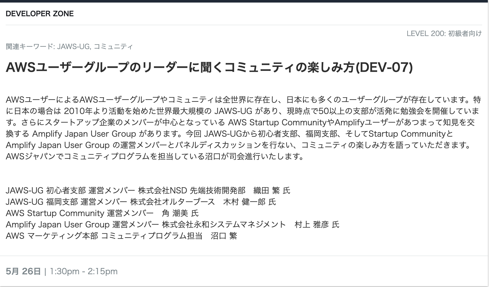

5 月 25 日（水）、26 日（木）に開催される [AWS Summit Online](https://aws.amazon.com/jp/summits/japan/) の開発者向けセッション
[AWS ユーザーグループのリーダーに聞くコミュニティの楽しみ方(DEV-07)](https://aws.amazon.com/jp/summits/japan/sessions/?aws-summit-japan-2022-cards.sort-by=item.additionalFields.sortOrder&aws-summit-japan-2022-cards.sort-order=asc&awsf.level=*all&awsf.session-category=session-category%23dev-zone&awsf.company-category=*all&awsf.industry=*all&awsf.use-case=*all&aws-summit-japan-2022-cards.q=DEV-07&aws-summit-japan-2022-cards.q_operator=AND)というセッションに [Amplify Japan User Group](https://aws-amplify-jp.github.io/) の運営メンバーとして登壇しました。

セッションは次の 5 人によるパネルディスカッションでした。

- AWS の沼口さん
- JAWS-UG 初心者支部の織田さん
- JAWS-UG 福岡支部の木村さん
- AWS Startup Community の角さん
- Amplify Japan User Group の村上

司会進行役の AWS 沼口さんと角さんは現地から、私を含む他の方はオンラインでの登壇でした。

## セッションの内容

セッションは以下の質問を各ユーザーグループのメンバーに聞いて行って、各ユーザーグループの特徴などを沼口さんが紹介するという形式ですした。

- ユーザーグループ/ユーザーコミュニティに参加したきっかけは？
- ユーザーコミュニティの魅力は？
- ユーザーコミュニティへの参加に躊躇している人へ一言

私からはそれぞれの質問に対して、次のようにお話しさせていただきました。

### ユーザーグループ/ユーザーコミュニティに参加したきっかけは？

2020 年に仕事で Amplify を利用してサービスを開発をしていました。Amplify の日本語の情報を求めて Ampify Japan User Group に辿り着きました。
2021 年 3 月頃、当時 AWS Developer Relations Engineer だった watilde さんが amplify-cli の coverage をあげる活動をされていてそれに参加するようになりました。2021 年 7 月にはそれらの amplify-cli に対してコントリビュートしていたのがきっかけで運営メンバーに誘ってもらいました。

### ユーザーコミュニティの魅力は？

コミュニティに参加していなかったら出会わなかったかもしれない人たちと知り合い、活動することで、今までにない新しい経験ができることです。私自身も今日 AWS Summit で話をする側になるという経験は 1 年前には考えられなかったことです。
コミュニティに参加すると、技術でも人との関係でも本当に世界が広がると思います。

### ユーザーコミュニティへの参加に躊躇している人へ一言

最初はコミュニティの Slak に入ってみるとか、リアクションをつけるだけでもいいと思います。
イベントに参加して他の人の発表を聞くだけでも OK だと思います。
そうやってコミュニティとの接点をもっておくと、ふと自分の気になる情報や興味のある話題がやりとりされることがあったりします。
その時にはちょっと勇気を出して一言発言してみたりすると、コミュニティとのよりよい関わりを築くことができるのではないかと思います。まずは一歩踏み出してみると、そこからきっと何かが変わって動き出すと思います。

## 参加してみて

少し前なあら自分が AWS Summit に登壇するとは全く考えられなかったので自分でも驚きです。
他のみなさんもおっしゃってましたが、「コミュニティに参加することで自分も周りにも変化が生まれる、世界が変わる。まずはその一歩を踏み出してみよう。」というのが大事だなと再認識しました。
そもそも自分がどうしてコミュニティに参加してどうしたいのかということを見直すよいきっかけにもなりました。
自分は Amplify が公開している OSS に対するコントリビュートを活動の中心にしていきたいと再認識できました。そしてそこで得た知見をコミュニティに還元できたらと考えています。

## 最後に

少しでも Amplify に興味のある方、是非 Amplify Japan User Group に参加していただければと思います。
まずは、ユーザーグループの Slack があるのでこちらから参加してください。お待ちしています。

そして、既にユーザーグループに参加していただいている方で運営に参加してみたいと思っている方がいらっしゃればぜひ Slack で声をかけてください。
よろしくお願いします。

尚、6 月 30 日まで[こちら](https://summits-japan.virtual.awsevents.com/media/AWS%E3%83%A6%E3%83%BC%E3%82%B6%E3%83%BC%E3%82%B0%E3%83%AB%E3%83%BC%E3%83%97%E3%81%AE%E3%83%AA%E3%83%BC%E3%83%80%E3%83%BC%E3%81%AB%E8%81%9E%E3%81%8F%E3%82%B3%E3%83%9F%E3%83%A5%E3%83%8B%E3%83%86%E3%82%A3%E3%81%AE%E6%A5%BD%E3%81%97%E3%81%BF%E6%96%B9/1_a3t15p47)でオンデマンド配信をしています。
当日見れなかったけど見たいという方はご覧ください（視聴するには AWS Summit への登録とログインが必要です）。
