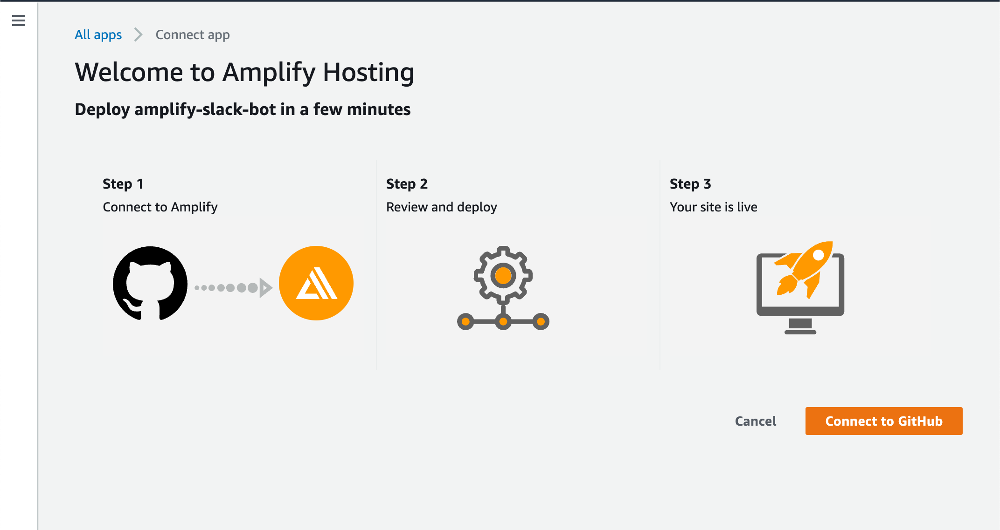
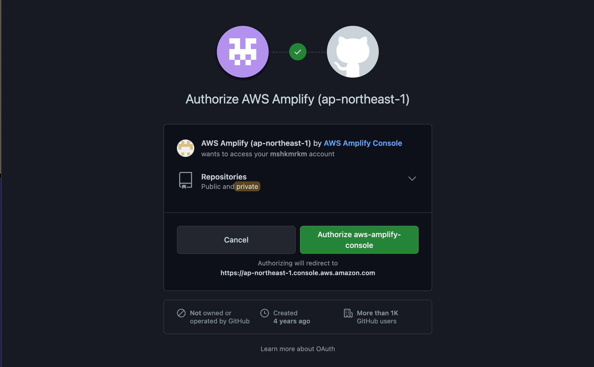
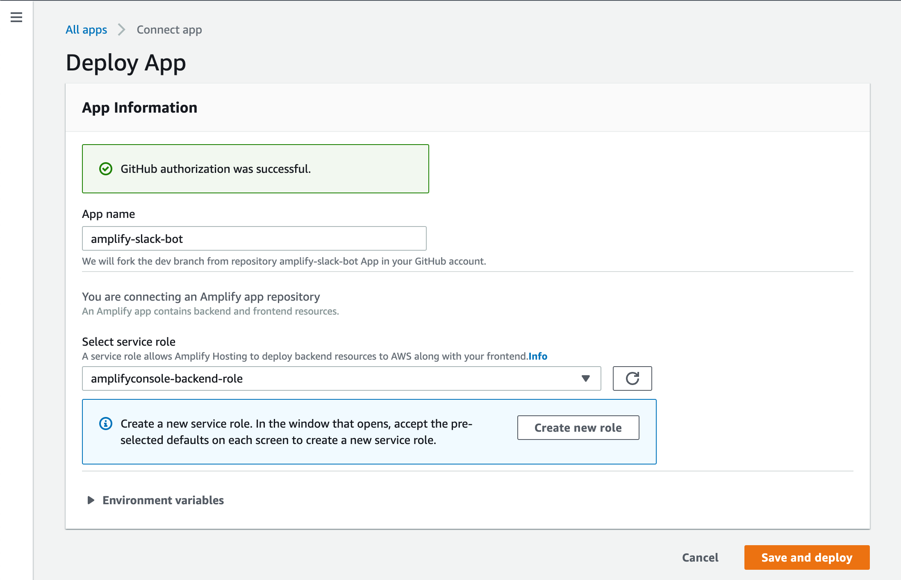
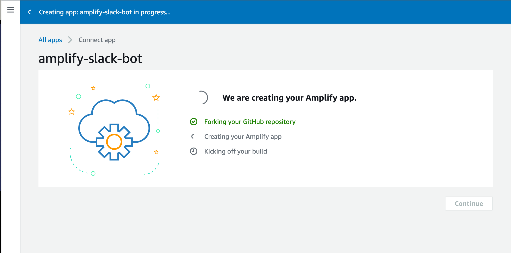
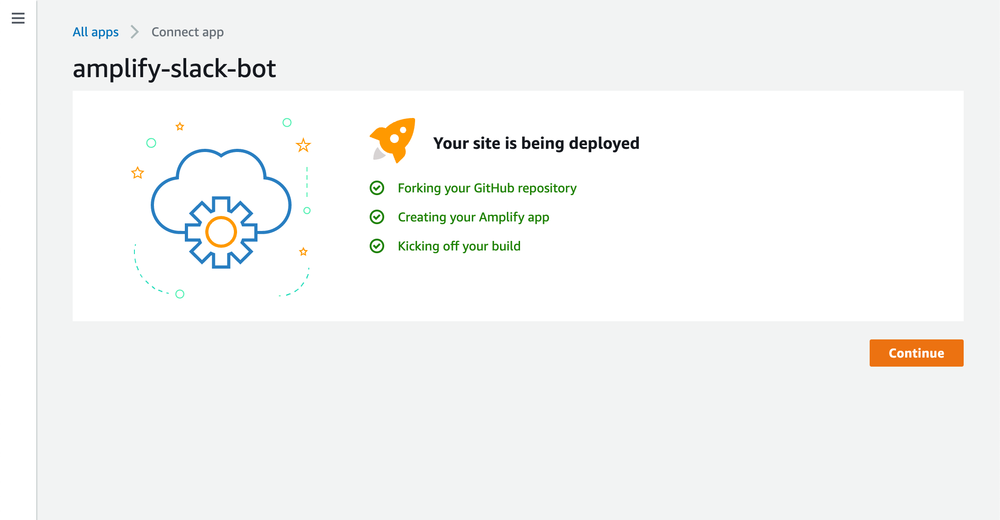
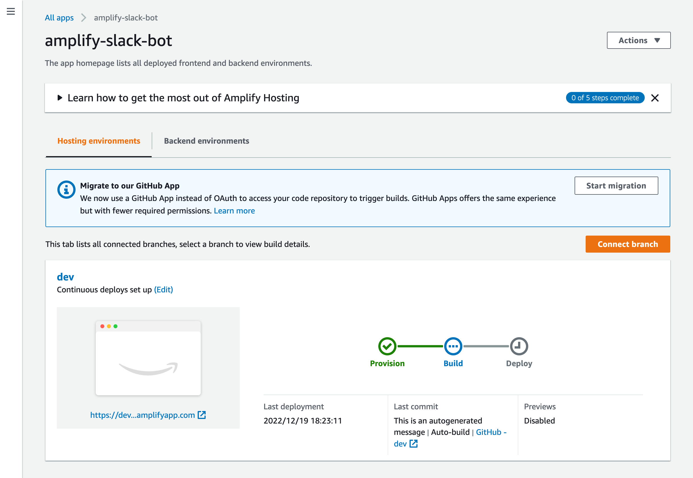
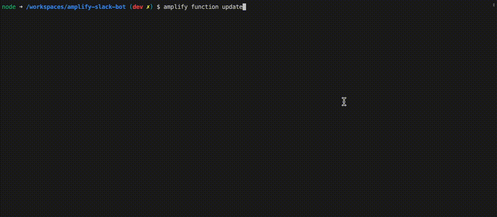

この記事は [AWS Amplify と AWS× フロントエンド Advent Calendar 2022](https://qiita.com/advent-calendar/2022/amplify)、[AWS Community Builders Advent Calendar 2022](https://adventar.org/calendars/7633) と [ESM Advent Calendar 2022](https://adventar.org/calendars/8218) の 20 日目の記事です。
欲張って 3 つもクロスポストしてしまいました。

## `Deploy to Amplify Console`ボタン

[公式の Amplify ユーザーガイド](https://docs.aws.amazon.com/amplify/latest/userguide/one-click.html)にも書かれている以下のボタンのことです。


このボタンをブログや GitHub リポジトリの README.md などに設置すると、その GitHub リポジトリの Amplify アプリをワンクリックでデプロイできるというものです。

ただ、私はこのボタンを見たことがなく、ユーザーガイドの説明もシンプルなので具体的にどういう使い勝手なのかが想像できませんでした。また紹介した記事も見たことがなかったので実際にどんな風に使えるのか試してみました。

## 実際にボタンを設置してみた

https://github.com/fossamagna/amplify-slack-bot のリポジトリの README.md に設置しました。ボタン自体は単なるリンクなので Markdown なら以下のように書くことで簡単に設置できます。

```md
[](https://console.aws.amazon.com/amplify/home#/deploy?repo=https://github.com/fossamagna/amplify-slack-bot)
```

[](https://console.aws.amazon.com/amplify/home#/deploy?repo=https://github.com/fossamagna/amplify-slack-bot) そして、これが実際に設置したボタンです（クリックすると操作します）。

ちなみに、今回このボタンでデプロイできるのは、Amplify Console のビルド結果を Slack に通知するアプリです。
以前から、amplify cli のプラグインとして公開していた https://github.com/fossamagna/amplify-category-console-notification をアプリにしたものです。

## ボタンを押してみる

実際にボタンをクリックすると GitHub と接続する画面が表示されます。もし、AWS コンソールにログインしていない場合はログイン画面が表示されて、ログインするとこの画面が表示されます。`Connect to GitHub`ボタンをクリックして GitHub と接続します。


初めて、Amplify を使う場合は、次の画面が表示されます。アプリは Amplify Console を使ってデプロイされるので、`Authorize aws-amplify-console`ボタンをクリックして承認します。


次に、デプロイするアプリの名前とデプロイ時のサービスロールを指定します。自分で Amplify アプリをデプロイするときにも入力する項目なので Amplify を使ったことがある人には馴染みがあるかもしれません。初めて Amplify Console を利用する方は[こちらのドキュメント](https://docs.aws.amazon.com/amplify/latest/userguide/how-to-service-role-amplify-console.html)に書かれた手順でサービスロールを追加する必要があります。
また、デプロイするアプリが利用する AWS サービスによっては通常の Amplify のサービスロールでは足りないこともあります。リポジトリの README.md などアプリのドキュメントに追加で必要な権限がないか確認してみてください。



`amplify-slack-bot`ではサービスロールに以下の権限の追加が必要です。

```json
{
  "Version": "2012-10-17",
  "Statement": [
    {
      "Sid": "VisualEditor0",
      "Effect": "Allow",
      "Action": [
        "lambda:CreateFunctionUrlConfig",
        "lambda:GetFunctionUrlConfig",
        "lambda:DeleteFunctionUrlConfig",
        "lambda:UpdateFunctionUrlConfig",
        "sns:GetTopicAttributes",
        "sns:SetTopicAttributes",
        "sns:DeleteTopic",
        "sns:CreateTopic",
        "sns:Subscribe"
      ],
      "Resource": [
        "arn:aws:lambda:*:<accountId>:function:*",
        "arn:aws:sns:*:<accountId>:*"
      ]
    }
  ]
}
```

`Save and deploy`ボタンをクリックすると、アプリの作成が始まります。



アプリが無事作成されると、全てのチェックが付いて、`Continue`ボタンがクリックできるようになります。



`Continue`ボタンをクリックすると Amplify Console を利用してアプリのデプロイが開始されます。



エラーなどが発生しなければデプロイ完了です。

### `amplify-slack-bot`の場合の追加設定

デプロイするアプリによっては、ここまでのデプロイまでの手順に追加で設定が必要になります。`amplify-slack-bot`もいくつか設定が必要です。
まず、自分の GitHub アカウントに`amplify-slack-bot`を fork したリポジトリが作成されているはずなので、そのリポジトリを clone します。
clone できたら`amplify pull`でデプロイしたアプリを pull しておきます。

```
git clone <url of your amplify-slack-bot repository>
cd amplify-slack-bot
amplify pull
```

#### Slack アプリのシークレットの設定

`amplify-slack-bot`は Slack アプリとして動作するため、Slack 側での操作も必要です。[こちらの手順で Slack アプリのセットアップ](https://github.com/fossamagna/amplify-category-console-notification/blob/main/packages/amplify-slack-app/docs/SETUP.md)を行ってください。
その後、以下の 3 つのシークレットを AWS のパラメーターストアに設定します。

- SLACK_SIGNING_SECRET
- SLACK_BOT_TOKEN
- SLACK_DEFAULT_CHANNEL

値の設定は amplify コマンドを使います。`amplify function update`で以下のようにシークレットの値を設定します。



#### `amplify/backend/function/slackApp/parameters.json`の編集

次に、上記で設定した 3 つのシークレットを Slack アプリの Lambda 関数から読み取るために必要な値を設定します。
`amplify/backend/function/slackApp/parameters.json`の`secretsPathAmplifyAppId`にデプロイしたアプリの ID を設定します。

```json
{
  "secretsPathAmplifyAppId": "<appId>"
}
```

以下のコマンドを実行するとアプリの ID が取得できるので、`<appId>`の部分をその値で置き換えてください。ファイルを書き換えたら git で commit & push します。

```
amplify env get --name dev | grep AmplifyAppId
```

git push すると Amplify Console でビルドが自動で開始され、設定した Slack チャネルで Amplify Console のビルド通知が受け取れるようになります。

## やってみた感想

実際にボタンを設定して、アプリを追加するまでをやってみて、ボタンを利用する側とそれを設定する側の Pros & Cons を考えてみました。

### ボタンを利用する側

- Pros:
  - `Deploy to Amplify Console`ボタンをクリックしてからブラウザのみでウィザード形式でアプリのデプロイまでできる。（ブラウザのみで完結できるかはアプリ次第ではある）
- Cons:
  - アプリが利用するサービスによっては、ウィザード形式とは別の手順が必要になってしまう。
  - デプロイに失敗した場合、原因特定が大変そう。
  - public リポジトリとして一般に公開する場合、GitHub の fork を利用しているため、fork したリポジトリの visiblity を変更できない。少なくとも public を private にはできない。fork した後に追加、編集したいいファイルがあって内容的に public では困るというパターンはありそう。

### ボタンを設置する側

- Pros:
  - 作った Amplify アプリを共有しやすい（使ってもらいやすい）
- Cons:
  - ウィザード形式とは別の手順は完全独自に用意しないといけない。

アプリによって追加で設定が必要な値がブラウザ内で完結できるような仕組みがあると、アプリの公開側も利用者側もうれしいんではないかと思います。シークレット値(パラメーターストアの値)を設定するために、fork したリポジトリを clone して amplify コマンドを実行しないといけないのはユーザー体験としてはよくないなと感じました。
JSON や YAML で追加設定項目を定義したファイルをリポジトリに含めればアプリ追加時に設定項目をカスタマイズできたりするといいなと思います。
今回やってみて考えたことなどは https://github.com/aws-amplify/amplify-hosting の Issue で Amplify の開発チームなどにフィードバックしていこうと思います。

最後に、Amplify と Slack を使っている方がいらっしゃれば、今回用意した`amplify-slack-bot`を使ってみてもらえると嬉しいです。そしてフィードバックなどいただけると非常にありがたいです。よろしくお願いします。
