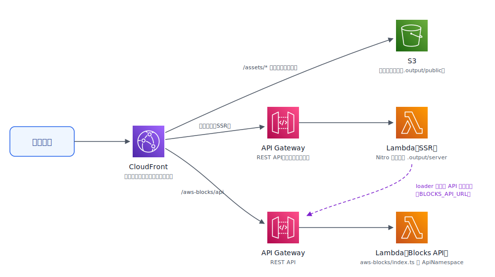

[AWS Blocks](https://www.npmjs.com/package/@aws-blocks/blocks) は、TypeScript だけでバックエンドとインフラをまとめて定義できる AWS のツールキットです。個人開発のアプリを AWS Blocks で動かしてみたところ、フロントエンドに使っていた [TanStack Start](https://tanstack.com/start) の SSR も CloudFront + Lambda でホスティングできました。ただ、ドキュメントに載っているフレームワークは Next.js や SPA が中心で、TanStack Start を動かすには少し工夫が要ります。この記事では、実際に動く最小構成のサンプルを使って、そのポイントを説明します。

サンプルのコードはこちらです。

https://github.com/fossamagna/tanstack-start-aws-blocks-example

## AWS Blocks とは

AWS Blocks は「Building Block」と呼ばれる部品（認証、KVストア、テーブル、ファイルバケットなど）を TypeScript でつなぎ合わせてバックエンドを作るツールキットです。特徴的なのは開発体験で、`npm run dev` するとすべての Block がローカルのモックで動くため、AWS アカウントなしでローカル開発できます。デプロイすると同じコードがそのまま DynamoDB や Lambda などの実サービスに切り替わります。

プロジェクトの雛形は `create-blocks-app` で作れます。

```sh
npx @aws-blocks/create-blocks-app my-app --template react
```

今回のサンプルもこの react テンプレート（Vite + React の SPA 構成）から出発して、フロントエンドを TanStack Start に差し替えました。バックエンドは認証もデータベースもない、API メソッド 1 本だけの最小構成です。

```typescript
// aws-blocks/index.ts
import { ApiNamespace, Scope } from '@aws-blocks/blocks';

const scope = new Scope('tanstack-start-example');

export const api = new ApiNamespace(scope, 'api', () => ({
  /** SSR の動作確認用: API が動いている場所の情報を返す */
  async getServerInfo() {
    return {
      message: 'Hello from AWS Blocks API!',
      region: process.env.AWS_REGION ?? 'local',
      serverTime: new Date().toISOString(),
    };
  },
}));
```

フロントエンドからは `import { api } from 'aws-blocks'` と書くだけで、この API を型付きで呼べます。HTTP のエンドポイントやクライアント生成を意識する必要はありません。

## 全体アーキテクチャ

デプロイすると次の構成になります。CloudFront がパスに応じてオリジンを振り分け、静的アセットは S3 へ、SSR は [Nitro](https://nitro.build/) ビルドの Lambda へ、API 呼び出しは Blocks API の Lambda へ届きます。SSR と API の 2 つの Lambda の前には、それぞれ API Gateway（REST API）が置かれます。



ここから、TanStack Start を動かすためのポイントを 3 つ説明します。

## ポイント1: nitro プラグインで aws-lambda 向けにビルドする

現在の TanStack Start は Nitro を内蔵していません。Nitro は、あらゆるランタイム・あらゆるデプロイターゲットと互換性のあるフルスタックのサーバーフレームワークで、ビルド時に `preset` を指定するとデプロイ先に合わせたサーバーバンドルを出力してくれます。`vite build` するとサーバー用のバンドルは出力されますが、そのままでは Lambda で動くエントリポイントがありません。そこで `nitro` パッケージの Vite プラグインを追加して、Lambda ハンドラを含む `.output/` ディレクトリを生成します。

```typescript
// vite.config.ts
import { defineConfig } from 'vite';
import { tanstackStart } from '@tanstack/react-start/plugin/vite';
import { nitro } from 'nitro/vite';
import viteReact from '@vitejs/plugin-react';

export default defineConfig(({ command }) => ({
  resolve: {
    conditions: ['browser'],
  },
  plugins: [
    tanstackStart(),
    ...(command === 'build' ? [nitro({ preset: 'aws-lambda', awsLambda: { streaming: true } })] : []),
    viteReact(),
  ],
}));
```

ここで押さえておくところは 2 つです。

まず、nitro プラグインは `command === 'build'` のときだけ有効にします。dev サーバーでも nitro を有効にすると TanStack Start 自身の SSR と競合して挙動が壊れるためです。dev では TanStack Start がそのまま SSR してくれるので、nitro はビルド時だけで十分です。

次に `awsLambda: { streaming: true }` は必須です。AWS Blocks の Hosting は SSR を API Gateway（REST API）のレスポンスストリーミングで配信するため、バッファ型のハンドラを置くと CloudFront から 502 が返ってきます。私はここでしばらくハマりました。

## ポイント2: Hosting ブロックに framework: 'nitro' を指定する

CDK 側は、テンプレートが生成する `aws-blocks/index.cdk.ts` の `Hosting` に `framework: 'nitro'` を指定するだけです。SPA テンプレートとの差分は 2 行だけです。

```typescript
// aws-blocks/index.cdk.ts（抜粋）
if (!sandboxMode) {
  new Hosting(blocksStack, 'Hosting', {
    root: join(__dirname, '..'),
    buildCommand: 'npm run build',
    framework: 'nitro',        // ← nitro アダプタで .output/ を配信
    buildOutputDir: '.output', // ← SPA テンプレートでは 'dist'
    api: blocksStack
  });
}
```

`Hosting` の `framework` オプションのドキュメントには `'spa' | 'static' | 'nextjs'` と書かれていますが、実装には Nuxt や Astro と並んで nitro アダプタが入っており、`'nitro'` を指定できます。Nitro の `.output/` は Nuxt でも使われている汎用フォーマットなので、これを経由することで TanStack Start もホスティングできる、という仕組みです。

`api: blocksStack` を渡しておくと、CloudFront の `/aws-blocks/api` パスがバックエンドの Lambda にプロキシされ、フロントエンドとバックエンドが同一オリジンになります。CORS の設定は不要です。

## ポイント3: loader から Blocks API を呼ぶ

TanStack Start のルートの loader は、初回アクセスではサーバー（SSR Lambda）で、以降のクライアント遷移ではブラウザで実行されます。AWS Blocks のクライアントはどちらの環境でも同じように動くので、loader に `api.getServerInfo()` と書くだけで済みます。

```tsx
// src/routes/index.tsx（抜粋）
import { createFileRoute } from '@tanstack/react-router';
import { api } from 'aws-blocks';

export const Route = createFileRoute('/')({
  loader: () => api.getServerInfo(),
  component: Home,
});
```

これが動くのは、環境ごとに API の URL を解決する仕組みが用意されているからです。SSR Lambda では Hosting ブロックが環境変数 `BLOCKS_API_URL`（Blocks API の API Gateway エンドポイント）を自動で注入し、クライアントはそれを読んで Blocks API を呼びます。ブラウザではホスティングオリジンの設定ファイル（`/.blocks-sandbox/config.json`）から URL を取得して、CloudFront のプロキシ経由で呼びます。どちらもアプリのコードからは見えません。

なお、今回のサンプルは認証なしなので loader から API を呼ぶだけですが、認証付きの API を SSR から呼ぶ場合は `withAuth`（`@aws-blocks/blocks/server`）を使って、ブラウザから届いた Cookie を API 呼び出しに引き継ぎます。Next.js と Nuxt には Cookie の自動検出が組み込まれていますが、TanStack Start は対象外なので、リクエストヘッダから取り出して第 2 引数に渡します。

```tsx
// 参考: 認証付き API を SSR から呼ぶ場合（サンプルには含まれていません）
import { createServerFn } from '@tanstack/react-start';
import { getRequestHeader } from '@tanstack/react-start/server';
import { withAuth } from '@aws-blocks/blocks/server';
import { api } from 'aws-blocks';

const getMyPosts = createServerFn().handler(() =>
  withAuth(() => api.listMyPosts(), getRequestHeader('cookie')),
);
```

## デプロイと動作確認

デプロイはテンプレート付属のスクリプトを実行するだけです。ビルド、CDK synth、デプロイまで一括で走ります。

```sh
npm run deploy
```

完了すると CloudFront の URL が出力されます。開くと loader の結果が表示されますが、SSR を確認するならページのソース（view-source）を見るのが確実です。

```html
<li>message: Hello from AWS Blocks API!</li>
<li>region: ap-northeast-1</li>
<li>serverTime: 2026-07-17T13:36:20.164Z</li>
```

HTML に API のレスポンスがそのまま入っています。ブラウザに JavaScript が届く前の段階で、SSR Lambda が Blocks API を呼んでレンダリングした証拠です。ページ上の「ブラウザから再取得」ボタンを押すと、今度は同じ API をブラウザから呼び直します。同じ `api.getServerInfo()` という呼び出しが両方の環境で動いていることを確認できます。

## ハマりどころ: config.json のキャッシュ

1 つだけ AWS Blocks のバグを踏んだので書き残しておきます。ブラウザ側の API URL 解決に使われる `config.json` は、デプロイ時に一度プレースホルダがアップロードされてから実際の値で上書きされます。ところが CloudFront のキャッシュキーが内部的に `/builds/<buildId>/` 配下に書き換えられているため、デプロイ後のキャッシュ無効化（`/.blocks-sandbox/*`）がこのキーにマッチせず、プレースホルダが最長 1 年間キャッシュされ続けます。この状態になるとブラウザからの API 呼び出しがすべて失敗します。

サンプルでは `patch-package` で無効化パスを `/*` に広げて回避しています（`patches/` ディレクトリ参照）。`npm install` 時に自動で適用されるので、サンプルを使う分には意識する必要はありません。本家には修正の [PR](https://github.com/aws-devtools-labs/aws-blocks/pull/174) を出してあるので、取り込まれればこの patch は不要になります。

## まとめ

AWS Blocks の Hosting ブロックは nitro アダプタを持っているので、Nitro の `.output/` を生成できるフレームワークなら公式サポートリストにないものでもホスティングできます。TanStack Start の場合、必要な変更は vite.config.ts に nitro プラグインを足すことと、Hosting に `framework: 'nitro'` を指定することの 2 点だけでした。

コードはすべてサンプルリポジトリにあります。`npm run dev` はモックで動くので、AWS アカウントがなくても手元で試せます。

https://github.com/fossamagna/tanstack-start-aws-blocks-example
