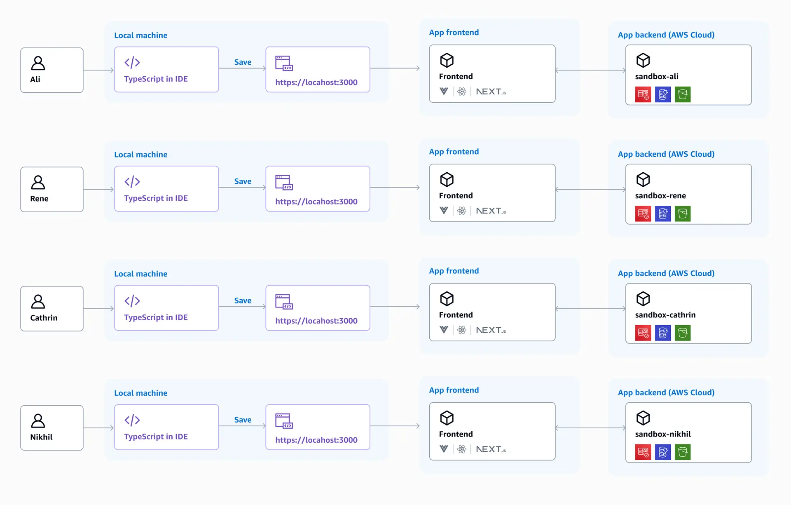
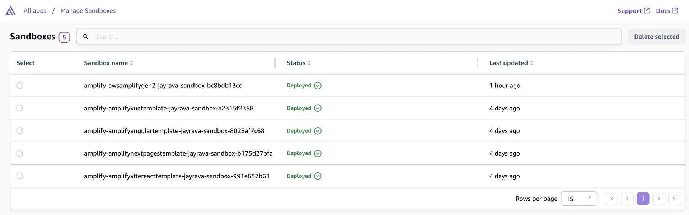
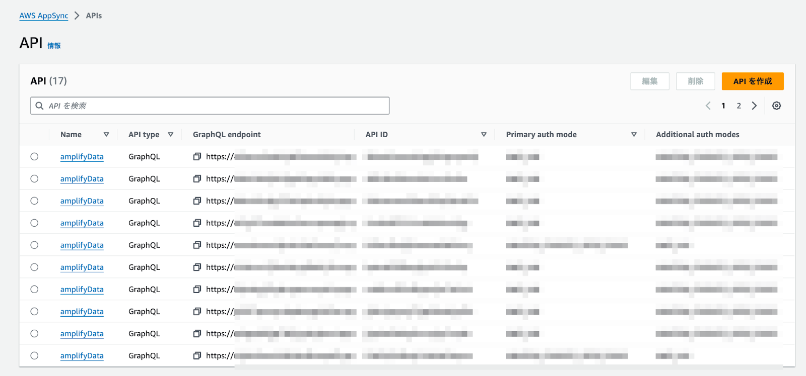
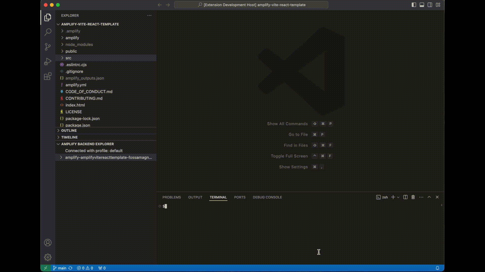

この記事は [AWS Amplify と AWS× フロントエンド #AWSAmplifyJP Advent Calendar 2024](https://qiita.com/advent-calendar/2024/amplify)、[AWS Community Builders Advent Calendar 2024 シリーズ 2](https://qiita.com/advent-calendar/2024/aws-community-builders)、[ESM Advent Calendar 2024](https://adventar.org/calendars/10806) の 2 日目の記事です。

## Amplify Gen2 GA

今年は 2024/5/6 に AWS Amplify Gen2 が GA になりました。Gen1 とは別に Gen2 は AWS CDK をベースに新たに作成されました。
Amplify Gen2 は次のような特徴を持っています。

- AWS CDK をベースとする次世代の Amplify のバックエンド構築ツール
- TypeScript によるバックエンド定義を提供
- **開発者毎の独立した sandbox 環境を提供**
- Git のブランチと AWS 環境を 1:1 でマッピング

## Amplify Gen2 Sandbox

Amplify Gen2 の特徴の中でも特に便利だと思うのが、[Amplify Gen2 sandbox 環境](https://docs.amplify.aws/react/deploy-and-host/sandbox-environments/setup/)の機能です。 Amplify Gen2 sandbox 環境は開発者ごとの独立したクラウドサンドボックス環境で、チームの各開発者は、sandobox 環境の機能により自分の変更をテストできる隔離されたクラウド開発環境を利用するができます。

**画像は [Amplify Docs](https://docs.amplify.aws/react/deploy-and-host/sandbox-environments/setup/) より引用**

sandbox 環境の構築は非常に簡単で `npx ampx sandbox` コマンドを実行するだけです。
さらに、CDK ベースとなったことで hot swap デプロイにより、より迅速なイテレーション開発が可能です。Lambda のソースコードの修正などはこの hot swap デプロイが利用できるので、エディタでコードを修正して保存すると数秒でデプロイが完了してすぐに動作を確認することができます。

## Amplify Gen2 Sandbox で困ったこと

Amplify Gen2 sandbox 環境はこのようにとても便利ですが、困った点もありました。

Amplify によって sandbox 環境には多くの AWS リソースが作成されます。
Amplify によって作成された AWS リソース（例えば、AppSync や Lambda、DynamoDB など）を AWS コンソールで確認したいことがあると思います。例えば、GraphQL リクエストを送信したり、DynamoDB テーブルの内容を確認したり、Lambda の実行ログを CloudWatch Logs で確認したりです。

Amplify コンソールでは Git ブランチに紐づいた共有環境の場合は AWS リソースのリストが表示されて確認できますが、残念ながら、sandbox 環境は以下のように 1 行で表示されるだけで、sandbox 内の AWS リソースは確認できません。

**画像は [Amplify Docs](https://docs.amplify.aws/react/deploy-and-host/sandbox-environments/setup/#manage-sandbox-environments) より引用**

また、Amplify コンソールからではなく確認したいリソースの AWS コンソールから sandbox のリソースを探そうとしても、数か多かったり、名前が同じだったり、どの sandbox のリソースなのか判別しにくい名前になっていたりして目的のリソースにたどり着くのが大変です。
例えば、AppSync の場合、デフォルトでは API も名前が全て同じになってしまっていて、エンドポイント URL を手掛かりにして探すしかない状況です。

## Amplify Gen2 Sandbox で困ったことの解決方法

そこで、各開発者が自身の sandbox の AWS リソースだけを確認できる[AWS Amplify Backend](https://marketplace.visualstudio.com/items?itemName=fossamagna.amplify-backend-vscode&ssr=false#overview)という VSCode 拡張を作成・公開しました。

この VSCode 拡張の`Amplify Backend Expoloer`を利用すると、以下のように自身の sandbox 環境の AWS リソースのみをツリー表示できます。ツリーのノードは sandbox 環境内の AWS リソースに対応していて、それを選択して対象のリソースの AWS コンソールを開くこともできます。

この VSCode 拡張を使うと自身の sandbox の AWS リソースのみを参照できるので、AWS コンソールで sandbox 環境のリソースを探すのに苦労することがなくなりました。

また、sandbox 環境の AWS リソースを表示するのに加えてこの VSCode 拡張では以下の機能をサポートしています。

- AWS プロファイルの切り替え
- ツリーに表示するリソースをフィルターする機能
- sandbox 環境のシークレットを追加/編集/削除
- モノレポサポート

## まとめ

AWS Amplify は Gen2 になり CDK ベースとなったことで Gen1 の頃よりもさらに便利な機能が提供され利用できるようになりました。そして、Amplify Gen2 sandbox をより便利に利用するために VSCode 拡張を作成・公開しました。

ぜひ、Amplify Gen2 を利用してみてもらいたいと思います。そして VSCode 拡張も合わせて使ってもらえるとうれしいです。この VSCode 拡張は[GitHub リポジトリも公開](https://github.com/fossamagna/amplify-backend-vscode)しているので、機能追加要望やバグ報告の Issue、Pull Request も大歓迎です。
