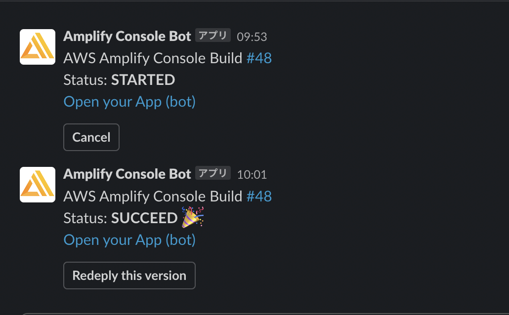
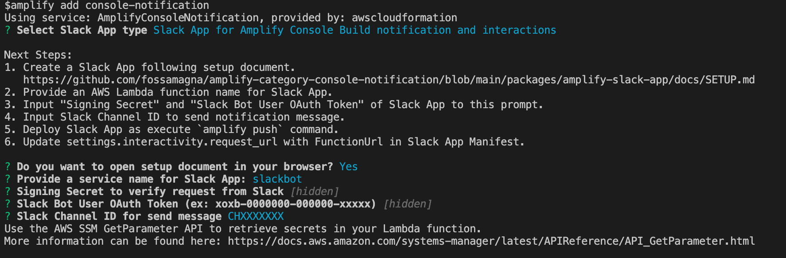

# Amplify Console の Slack アプリ

Amplify Console のビルト結果を Slack に通知する Amplify プラグインとして[amplify-category-console-notification][1]を公開しています。
最近、このプラグインに Slack アプリを追加しました。

[amplify-category-console-notification][1]の Slack アプリを追加すると次のことができるようになります。

- Amplify Console のビルド開始・終了時に Slack メッセージで通知を受け取る
- Slack メッセージからそのバージョンを再デプロイする
- Slack メッセージから Amplify Console のビルドをキャンセルする


_Slack に通知されたビルド結果_

この Slack アプリを追加する以前は、[Slack の Incoming Webhook](https://api.slack.com/messaging/webhooks#getting_started)（以降、Webhook 版）を利用して Slack にビルド結果のメッセージを送信していました。
Webhook 版はシンプルな構成でビルド結果の通知ができていましが、ビルドに対するアクションも Slack 上からできると便利だと思い、Slack アプリ版を追加しました[^1]。

[^1]: Slack アプリ版を追加しましたが、Incoming Webhook 版も引き続き利用可能です。

# Slack アプリを追加する

Slack アプリを追加（利用）するには、Amplify プロジェクトで次のコマンドを実行して[amplify-category-console-notification][1]をインストールします。

```console
npm install -g amplify-category-console-notification amplify-slack-nodejs-function-template-provider
amplify plugin add $(npm root -g)/amplify-category-console-notification
```

インストールできたら、以下のコマンドで Slack アプリ追加を開始します。

```console
amplify add console-notification
```

コマンドを実行すると、Webhook 版と Slack アプリ版のどちらを使うのか聞かれるので Slack アプリを選択します。
Slack アプリを選択すると、Slack アプリを追加するの必要な手順がコンソールに表示されます。スクリーンキャプチャ付きのドキュメントの URL がコンソールに表示され、ブラウザでそのページが表示されるので、その手順に沿って Slack API のページで Slack App を作成してください。実際の手順は[こちら](https://github.com/fossamagna/amplify-category-console-notification/blob/main/packages/amplify-slack-app/docs/SETUP.md)から確認できます。


_コンソールに表示された Slack アプリを追加するの必要な手順_

Slack App を作成すると、Slack API のページで以下の値を確認できるようになります。コンソールのプロンプトでそれらの値の入力を求められるので入力してください[^2]。

- `Signing Secret`
- `Slack Bot User OAuth Token`
- `Slack Channel ID`

[^2]: 入力されたシークレット、トークンは AWS SSM に保存されます。

全て入力が完了したら、追加されたサービスのリソースを AWS 上に作成します。
`amplify push`するか、すでに Amplify Console と連携済みであれば`git commit`＆`git push`をすることで実行できます。
これ以降は、Amplify Console でビルドする度に、Slack に通知のメッセージが送信されるようになります。

# フィードバックのお願い

Amplify ユーザーの方に使っていただいてフィードバックをいただけると嬉しいです。バグ報告や改善提案など[GitHub の Issue](https://github.com/fossamagna/amplify-category-console-notification/issues/new/choose)、[Twitter](https://twitter.com/fossamagna)、[Amplify Japan User Group の Slack](https://github.com/aws-amplify-jp/awesome-aws-amplify-ja#slack)などでお待ちしています。

[1]: https://github.com/fossamagna/amplify-category-console-notification
